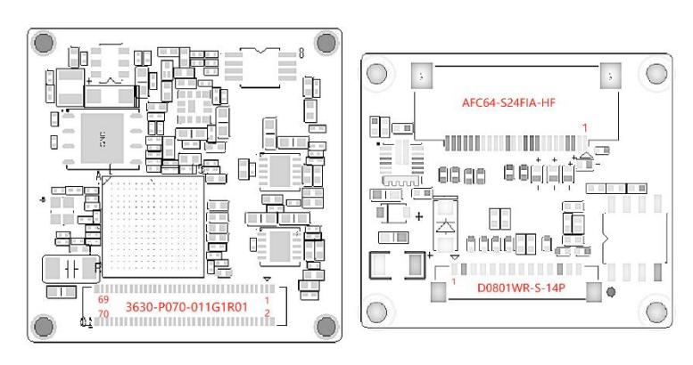
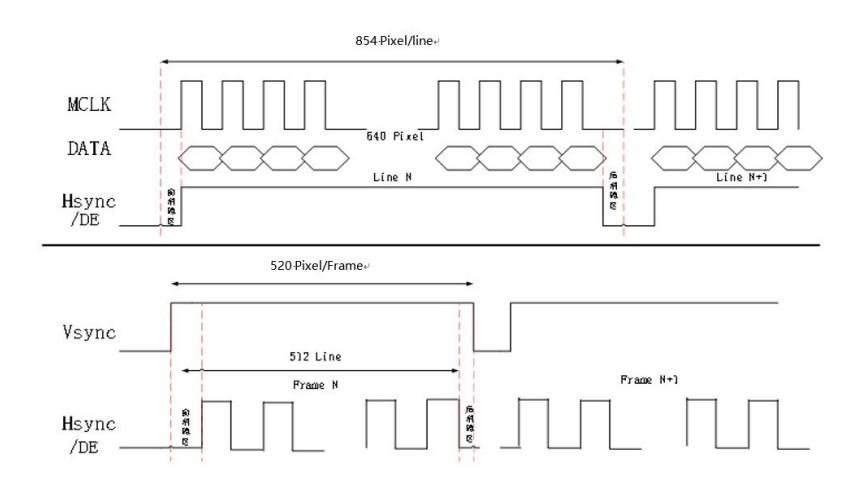
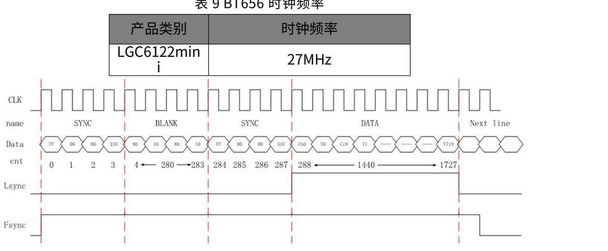
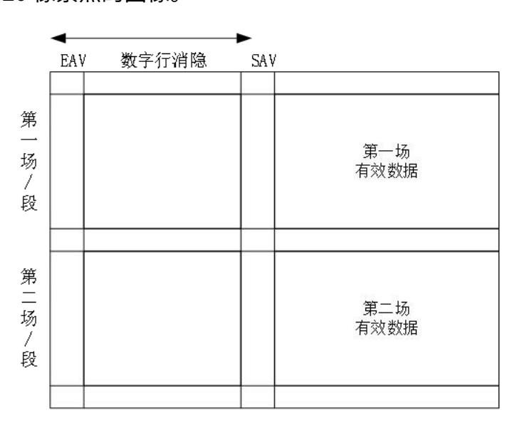
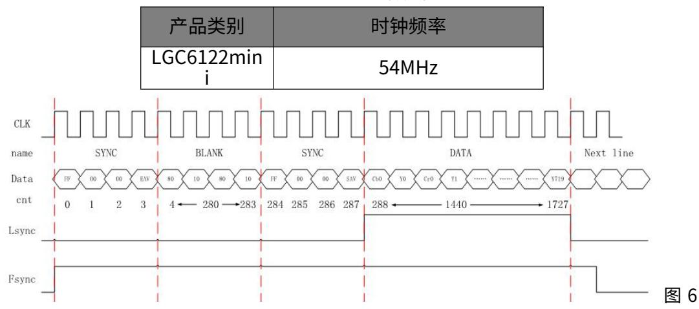
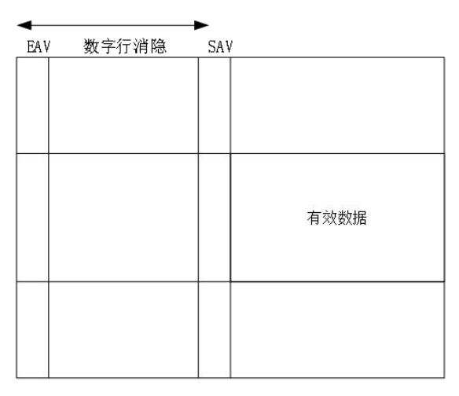
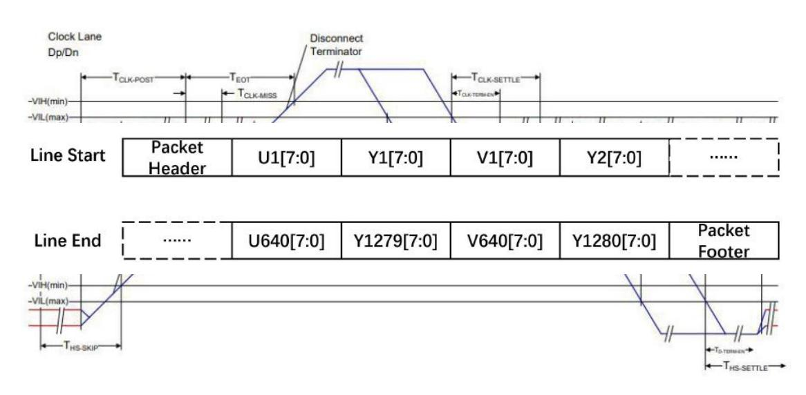
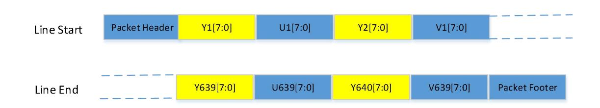
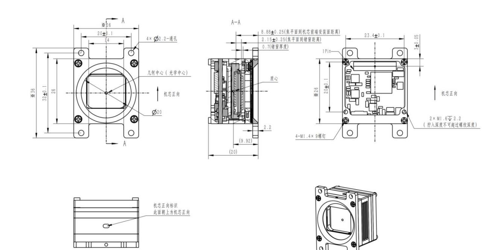
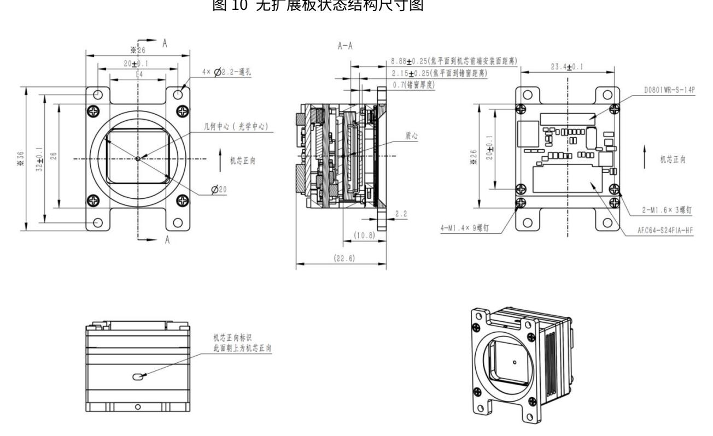

# LGC6122mini

640x512 非制冷红外机芯组件 产品说明书 V1.1.1

## 烟台艾睿光电科技有限公司

www.iraytek.com

## 目录

| 1  | 产品描述               | 6    |
|----|--------------------|------|
| 2  | 产品选型               | 6    |
| 3  | 镜头选型               | 6    |
| 4  | 产品性能参数             | 7    |
| 5  | 机芯组件用户接口说明         | 9    |
| 6  | 数字视频接口说明           | . 14 |
|    | 6.1 DVP 数字视频       | .14  |
|    | 6.2 BT656 数字视频     | .15  |
|    | 6.2.1 BT656 隔行数字视频 | 15   |
|    | 6.2.2 BT656 逐行数字视频 | 17   |
|    | 6.3 USB 格式         | . 18 |
|    | 6.4 MIPI 格式        | . 18 |
| 7  | 外同步                | . 19 |
| 8  | 结构尺寸               | . 20 |
| 9  | 通讯协议               | . 21 |
|    | 9.1 常用功能           | . 21 |
|    | 9.2 高级功能           | . 23 |
|    | 9.3 信息查询指令         | . 25 |
| 10 | )注意事项              | . 27 |
| 1  | 1 支持与服务            | . 29 |
|    | 11.1 技术支持          | .29  |
|    | 11.2 售后服务          | .29  |
| 1: | 2 公司信息             | . 29 |

©烟台艾睿光电科技有限公司 2024 保留一切权利。本手册全部内容,包括文字、 图片、图形等均归属于烟台艾睿光电科技有限公司(以下简称"本公司"或"艾 睿光电")。未经书面许可,任何人不得复制、影印、翻译、传播本手册的全部 或部分内容。

本手册描述的产品仅供中国大陆地区销售和使用。本手册作为指导使用。手册中 所提供照片、图形、图表和插图等,仅用于解释和说明目的,与具体产品可能存 在差异,请以实物为准。我们尽力确保本手册上的内容准确。本公司不对本手册 提供任何明示或默示的声明或保证。

因产品版本升级或其他需要,艾睿光电可能对本手册进行更新,如您需要最新版 手册,请与我司联系。艾睿光电建议您在专业人员的指导下使用本手册。

### 版本历史

| 版本     | 时间      | 说明                                       |
|--------|---------|------------------------------------------|
| V1.0.0 | 2024-10 | 初始版本                                     |
| V1.1.1 | 2025-6  | 增加编码方式切换 修改MIPI视频YUV描述 增加切换YUV顺序指令 |

## 1 产品描述

LGC6122mini 非制冷红外机芯组件是一款小尺寸、轻量级以及低功耗产品。 其支持多种串行通信和视频输出接口,同时可提供多种轻量化的红外镜头可供选 择。本产品具有良好的抗振动抗冲击性能,可为各种小型手持望远镜、头盔夜视 设备、轻型无人飞行器系统以及多种融合光电系统等,提供完善的红外成像解决 方案。同时可满足光电吊舱、车载应用、瞄具等对可靠性要求较高的产品开发需 求。

## 2 产品选型

表 1 产品命名规则

| 机芯型号                         | 帧频   | 用户扩展组件             | 镜头                                                                                 | 串口            | 模拟视频  | 环境适应性 |
|------------------------------|------|--------------------|------------------------------------------------------------------------------------|---------------|-------|-------|
| <b>LGC6122mini</b> : 640×512 | 50Hz | 无扩展组件 Mipi 扩展组件 | 无镜头 9.1mm F1.2 13mm F1.2 19mm F1.0 25mm F1.0 35mm F1.0 55mm F1.0 | RS422 Uart | PAL 制 | 标准产品  |

注:产品命名规则是对产品型号的解释,实际以艾睿光电提供为准,产品具体选型敬请咨询市场销售人员或技术支持。

## 3 镜头选型

表 2 镜头参数

| 机芯型号           | 阵列规模      | 镜头类型         | 焦距    | 光圏   | HFOV×VFOV | IFOV     |
|----------------|-----------|--------------|-------|------|-----------|----------|
|                |           |              | 9.1mm | F1.2 | 48°×38°   | 1.31mrad |
|                |           |              | 13mm  | F1.2 | 33°×26°   | 0.92mrad |
| LGC6122mini    | 640×512   | - - 无热化   | 19mm  | F1.0 | 22°×18°   | 0.63mrad |
| LGC0122IIIIIII | 040 \ 512 | <b>一元</b> 然化 | 25mm  | F1.0 | 17°×14°   | 0.48mrad |
|                |           |              | 35mm  | F1.0 | 12.5°×10° | 0.34mrad |
|                |           |              | 55mm  | F1.0 | 8°×6.4°   | 0.21mrad |

# 4 产品性能参数

表 3 技术参数

| 性能指标         |          | LGC6122mini                 |  |  |  |
|--------------|----------|-----------------------------|--|--|--|
| 探测器类型        |          | 氧化钒非制冷红外焦平面探测器              |  |  |  |
| 分辨率          |          | 640×512                     |  |  |  |
| 象元尺寸         |          | 12μm                        |  |  |  |
| 响应波段         |          | 8~14μm                      |  |  |  |
| 噪声等效温差(NETD) |          | <40mK @25℃,F#1.0         |  |  |  |
| 帧频           |          | 50Hz                        |  |  |  |
| 图像调节         |          |                             |  |  |  |
| 极性           |          | 黑热/白热(默认)                   |  |  |  |
|              | 亮度、对比度调节 | 可手动调节亮度/对比度                 |  |  |  |
| 伪彩           |          | 支持                          |  |  |  |
| 十字分划         |          | 显示/消隐(默认)/移动                |  |  |  |
|              |          | 非均匀性校正                      |  |  |  |
| 图像处理         |          | 数字滤波降噪                      |  |  |  |
|              |          | 数字细节增强                      |  |  |  |
| 电子变倍         |          | 1.0~8.0x 连续变倍(步长 0.1) |  |  |  |
| 图像镜像         |          | (3) 左右/上下/对角线            |  |  |  |
| 电源           |          |                             |  |  |  |
| 供电范围         |          | 用户扩展组件支持 5~20VDC         |  |  |  |
| 典型功耗@25℃     |          | ≤1W(不同接口功耗略有差异)             |  |  |  |
| 绝缘           |          | 机壳地与信号地、电源地绝缘,绝缘电阻>20MΩ     |  |  |  |
| 接口           |          |                             |  |  |  |
| 视 频       | 模拟视频     | 1 路 PAL 制式(仅支持调试)  |  |  |  |
| 输出           | 数字视频     | DVP/BT656/USB/MIPI-CSI      |  |  |  |
|              |          | UART(无扩展组件)                 |  |  |  |
| 串行通信接口       |          | RS422                       |  |  |  |
| 物理特性         |          |                             |  |  |  |
|              |          |                             |  |  |  |

| 重量(无镜头、无扩展组件)     | <30g                           |  |  |
|-------------------|--------------------------------|--|--|
| 尺寸(无镜头、无扩展组件)     | 26mm×26mm                      |  |  |
| 环境适应性             |                                |  |  |
| 工作温度 -40℃~+60℃ |                                |  |  |
| 存储温度              | -50℃~+75℃                      |  |  |
| 振动                | 6.06g,随机振动,所有轴                 |  |  |
| 冲击                | 80g,6ms,后峰锯齿波,3 轴 6 向 |  |  |
| 高冲击性              | 1000g 0.1ms 后峰锯齿波,光轴方向   |  |  |
| 功能                |                                |  |  |
| 自检                | 具备受令自检功能                       |  |  |
| 开机时间              | ≤8s                            |  |  |
| 快门校正时间            | ≤1.5s                          |  |  |
| 外同步功能             | 单端外同步(LVTTL 1.8V)           |  |  |
| 串口升级              | 具备串口升级固件的功能                    |  |  |
| 强光保护              | 强光保护功能(默认关)                    |  |  |
|                   |                                |  |  |

#### 注:

- (1) 常温测试环境为:温度 23~25℃,湿度 50~55%RH,标准大气压 101.325kPa,不带镜头;
- (2) 自检功能,实现对探测器、FLASH、温度传感器的自检;
- (3) 模拟视频、DVP 不支持伪彩;
- (4) 数据流延时最大 2 帧;上下/对角镜像有 1 帧延时,左右镜像无延时;由于带宽受限,图像镜像设 置上下或对角线时电子变倍只支持 1~2.4X,电子变倍设置 2.5~8X 时图像镜像只支持关或左右镜像;PAL 电 子变倍范围为 1~6.5X;
- (5) 外同步:外同步输入指机芯接收外同步信号进行工作,目前支持固定 50Hz 帧频;外同步输出指 机芯按工作帧频输出外同步信号;自适应指机芯上电 1s 内,收到外同步信号,则按外同步模式工作,否则按 普通工作模式工作,既不接收外同步信号,也不输出外同步信号;
  - (6) 视频模式切换,需机芯重新上电后生效。

## 5 机芯组件用户接口说明

机芯组件可提供无扩展板接口或 MIPI 扩展板,具体见下图所示。

图 1 电气接口图(左无扩展板,右 mipi 扩展板)

无扩展板组件接口采用 3630-P070-011G1R01(广东维峰电子有限公司)70 芯连接器,接口定义见表 4。对插连接器采用 3630-S070-029G1R01(广东维峰电子有限公司)。

说明 引脚序号 引脚名称 类型 电源输入(3.8±0.1V DC) 65,66,67,68,69,70 Main Power 电源 1,2,4,7,13,19,20,25,26,49,52,61 电源 电源地 GND ,62,63,64 UART 通信接口 2 (3.3V) ,此 6 UART2 RX P 输入 串口支持内部调试,不支持串口 8 UART2 TX P 输出 通信与串口更新 UART 通信接口 1 (3.3V) ,此 10 UART1 RX P 输入 串口支持串口通信,不支持串口 12 UART1\_TX\_P 输出 更新 14 UARTO\_RX\_P 输入 UART 通信接口 0 (3.3V) ,此 串口支持串口通信与串口更新 16 UARTO\_TX\_P 输出 未连 18 NC 未连接 接 54 SWD\_CLK 输出 JTAG 接口(3.3V) SWD IO 输入 56

表 4 红外组件接口定义

| 53 | WM_ROM ONLY | 输出        |                    |
|----|----------------|-----------|--------------------|
| 28 | DVP0           | 输出        |                    |
| 31 | DVP1           | 输出        |                    |
| 30 | DVP2           | 输出        |                    |
| 33 | DVP3           | 输出        |                    |
| 32 | DVP4           | 输出        |                    |
| 35 | DVP5           | 输出        |                    |
| 34 | DVP6           | 输出        |                    |
| 37 | DVP7           | 输出        | DVP/BT656 并行数字视频信号 |
| 36 | DVP8           | 输出        | (1.8V)             |
| 39 | DVP9           | 输出        |                    |
| 38 | DVP10          | 输出        |                    |
| 41 | DVP11          | 输出        |                    |
| 40 | DVP12          | 输出        |                    |
| 43 | DVP13          | 输出        |                    |
| 42 | DVP14          | 输出        |                    |
| 45 | DVP15          | 输出        |                    |
| 44 | DVP_VSYNC      | 输出        | 帧同步信号              |
| 47 | DVP_CLK        | 输出        | 时钟信号               |
| 46 | DVP_DE         | 输出        | 数据使能信号             |
| 29 | DVP_HSYNC      | 输出        | 行同步信号              |
| 48 | DVP_FSYNC0     | 输入/ 输出 | 外同步输出(1.8V)        |
| 50 | DVP_FSYNC1     | 输入/       | 外同步输入(1.8V)        |
| 22 | USB_DP         | 输入/ 输出 | USB 差分数据 P         |
| 24 | USB_DM         | 输入/输出     | USB 差分数据 M         |
| 58 | GPIO00         | 输入/       | 通用可编程输入输出接口(3.3V)  |

|    |             | 输出     |                         |  |
|----|-------------|--------|-------------------------|--|
| 51 | GPIO07      | 输入/    | 通用可编程输入输出接口(1.8V)       |  |
|    |             | 输出     |                         |  |
| 60 | GPIO03      | 输入/    |    通用可编程输入输出接口(3.3V) |  |
|    |             | 输出     |                         |  |
| 5  | VIDEO_GND   | 输出     | 模拟视频地                   |  |
| 3  | VIDEO       | 输出     | 模拟视频                    |  |
| 55 | GPIO05      | 输入/    | 通用可编程输入输出接口(1.8V)       |  |
| J5 | UP1005      | 输出     | 地州 以编任制入制山牧山 (1.88)     |  |
| 57 | GPIO10      | 输入/    |    通用可编程输入输出接口(1.8V) |  |
| J1 |             | 输出     | 旭川 山浦住棚八棚山女山 (1.0V)     |  |
| 59 | GPIO11      | 输入/    |    通用可编程输入输出接口(1.8V) |  |
| 33 |             | 输出     | 四円 5 端柱 部八 部 山 按口 (1.8) |  |
| 27 | NC          | 未连     |    未连接               |  |
| 21 | 140         | 接      | NALIX.                  |  |
| 9  | MIPI_DATA0- | 输出     |                         |  |
| 11 | MIPI_DATA0  | 输出     | MIPI 数据信号 0             |  |
| 11 | +           | #11141 |                         |  |
| 21 | MIPI_CLK-   | 输出     | MIPI 时钟信号               |  |
| 23 | MIPI_CLK+   | 输出     |                         |  |
| 15 | MIPI_DATA1- | 输出     |                         |  |
| 17 | MIPI_DATA1  | 输出     | MIPI 数据信号 1             |  |
|    | +           |        |                         |  |

Mipi 扩展板扩展板输出连接器采用深圳钜硕电子 AFC64-S24FIA-HF 型, 其接口定义如下表 5 所示:

表 5 红外扩展板接口定义

| 引脚序号 | 引脚名称     | 类型 | 说明     |
|------|----------|----|--------|
| 1    | 12V      | 电源 | 12V±4V |
| 2    | 12V      | 电源 | 12V±4V |
| 3    | GND      | 电源 | 电源地    |
| 4    | GND      | 电源 | 电源地    |
| 5    | RS422RX+ | 输入 | RS422  |

| 6  | RS422RX- | 输入 | RS422        |
|----|----------|----|--------------|
| 7  | RS422TX+ | 输出 | RS422        |
| 8  | RS422TX- | 输出 | RS422        |
| 9  | GND      | 电源 | 电源地          |
| 10 | IR_D1+   | 输出 | MIPI,红外 lan1 |
| 11 | IR_D1-   | 输出 | MIPI,红外 lan1 |
| 12 | NC       | 输出 | NC           |
| 13 | NC       | 输出 | NC           |
| 14 | GND      | 电源 | 电源地          |
| 15 | NC       | 输出 | NC           |
| 16 | NC       | 输出 | NC           |
| 17 | NC       | 输出 | NC           |
| 18 | NC       | 输出 | NC           |
| 18 | GND      | 电源 | 电源地          |
| 20 | IR_CLK+  | 输出 | MIPI,红外时钟    |
| 21 | IR_CLK-  | 输出 | MIPI,红外时钟    |
| 22 | IR_D0+   | 输出 | MIPI,红外 lan0 |
| 23 | IR_D0-   | 输出 | MIPI,红外 lan0 |
| 24 | GND      | 电源 | 电源地          |
|    |          |    |              |

红外机芯调试接口采用深圳长江连接器有限公司的 D0801WR-S-14P,接口定义如下表 6:

表 6 红外扩展板调试接口定义

| 引脚序号 | 引脚名称       | 类型    | 说明                      |
|------|------------|-------|-------------------------|
| 1    | Main_Power | 电源    | 电源输入(4±0.1V DC)         |
| 2    | GND        | 电源    | 电源地                     |
| 3    | USB_DP     | 输入/输出 | USB 差分数据 P              |
| 4    | USB_DM     | 输入/输出 | USB 差分数据 M              |
| 5    | UART2 RX P | 输入    | UART 通信接口(3.3V),支持内部调试, |
|      | UANTZ_NA_F | 十別人   | 不支持串口通信与串口更新            |

| 6 UART2_TX_P 输出 FSYNC 输入/输出 外同步信号 7 8 SWD_CLK / SWD 调试接口 9 WM_ROMONLY / 10 SWD_IO / 11 +3.3V 电源 电源输出 12 GND 电源 电源地 13 VIDEO_GND 输出 模拟视频地 14 VIDEO 输出 模拟视频 |  |  |  |
|--------------------------------------------------------------------------------------------------------------------------------------------------------------------------------------------------------------------------------------------------------------|--|--|--|
|                                                                                                                                                                                                                                                              |  |  |  |
|                                                                                                                                                                                                                                                              |  |  |  |
|                                                                                                                                                                                                                                                              |  |  |  |
|                                                                                                                                                                                                                                                              |  |  |  |
|                                                                                                                                                                                                                                                              |  |  |  |
|                                                                                                                                                                                                                                                              |  |  |  |
|                                                                                                                                                                                                                                                              |  |  |  |
|                                                                                                                                                                                                                                                              |  |  |  |
|                                                                                                                                                                                                                                                              |  |  |  |

## 6 数字视频接口说明

数字视频输出接口中,各数字视频可通过上位机指令切换。

#### 6.1 DVP 数字视频

机芯组件支持输出 DVP 数字视频,该数字视频包括 1 个时钟信号(Clock)、1 个行有效信号(Line\_Valid),1 个帧有效信号(Frame\_Valid) , 以及 8 个数据信号(DV8- DV15)。

表7 DVP 时钟频率

| P( )        | 211 . 37177 1 |
|-------------|---------------|
| 产品型号        | 时钟频率(Clock)   |
| LGC6122mini | 22.5MHz       |

图 2 DVP 数字视频时序图

表 8 DVP 时序说明

| 编号 | 信号    | 说明  | 备注                                            |
|----|-------|-----|-----------------------------------------------|
| 1  | MCLK  | 时钟  | 22.5MHz                                       |
| 2  | DATA  | 数据  | 有效数据640列×512行                                 |
| 3  | Hsync | 行同步 | 一行共854个时钟,其中640个时钟对应有效数据位,剩余 214个时钟对应消隐数据位 |
| 4  | Vsync | 帧同步 | 一帧共520行,其中512行为有效行,剩余8行为消隐行                   |
| 5  | DE    | 使能  | 与Hsync一致                                      |

DVP 视频数据每一个像素的数据对应 1 个时钟周期。每一帧的数据量与机芯探测器的面阵大小相同,机芯探测器面阵大小为 640\*512,DVP 每一帧包含 640\*512=327680 个像素的数据,每行有 640 个数据,共有 512 行。即每个行同

步信号高电平持续的时间为 640 个时钟周期,在一帧数据期间,行同步信号共有 512 次被置为高电平。在上图中,同步信号和数据信号都是在时钟的上升沿进行变 化,在实际的程序设计中,可以令信号在时钟的下降沿开始变化,以便于接收端 在时钟的上升沿进行采样。

### 6.2 BT656 数字视频

BT656 视频不需要帧同步信号和行同步信号,只需要 1 个时钟信号和 8 个数 据线。

BT656 视频按照数据的排列方式可以分为逐行方式和隔行方式。目前隔行模 式下机芯中输出总的面阵为 720×576,帧频为 25Hz。逐行输出时面阵同样为 720 ×576,帧频为 50Hz。

注意:自研 BT656 用户板时请注意,因时钟速率较高,部分线缆线损较多, 建议在用户板时钟管脚处增加 1.8V 的上拉。

### 6.2.1 BT656 隔行数字视频

隔行输出,即第 1、3、5……等行的数据为奇数场数据排在一起输出,而第 2、 4、6……等行的数据为偶数场数据排在一起输出,一帧的数据没有按照行号依次 排列,具体输出如下所示:

图 3 BT656 隔行时序图

BT656 视频每一行数据中包含了基准码(EAV/SAV)、消隐区(Blanking)、数据 区(Active Video)等三个部分,数据有效的行称为有效行,数据无效的行称为无效 行。BT656 视频没有行场同步信号,需要在 8 位数据中加入行与帧的标志位,以 表征该行或帧数据的起始或结束。这些标志位称之为同步基准码。每行包含 1728 个字节的数据,数据由水平控制信号和 YCbCr 视频数据信号组成,并以 Cb-Y-Cr-Y 的顺序排列,一行的前 288 字节是行控制信号,其以4字节的有效视频结束信号

开始,以"EAV"表示,其后是 140 个"80、10"固定数据,共 280 字节,最后 是4字节的有效视频起始信号,用"SAV"表示。水平控制信号后是有效视频数据, 共 1440 字节。偶数场与奇数场均为 288 行×720 像素点的图像,BT656 图像整 场为 576 行×720 像素点的图像。

图 4 隔行系统和分段系统中的场/段定时关系示意图 具体输出参考图 5:

|        | 行同步信号 |     |   |    |     |  |   |     |        |    |   |   | 视步      | 顶有     | 效化      | 言号     | ŝ |                  |
|--------|-------|-----|---|----|-----|--|---|-----|--------|----|---|---|---------|--------|---------|--------|---|------------------|
|        | E     | ٩V  |   | 65 |     |  |   |     |        | SA | V |   |         |        |         |        |   |                  |
| F F | 0     | 0 0 | X | 8  | 1 0 |  | 8 | 1 0 | F F | 0  | 0 | X | Cb 0 | Y 0 | Cr 0 | Y 1 |   | Y 7 1 9 |

图 5 有效行输出数据

"FF、00、00"是 SAV 和 EAV 信号 3 字节的前引,最后一字节"XY"用于 辨别该行位于整个数据帧的位置,还能准确区分 SAV、EAV 信号。"XY"字节各 比特位含义如表 12所示。其中:F=0 表示偶数场,F=1 表示奇数场;V=0 表示 该行含有效视频数据,V=1 表示该行无有效视频数据;H=0 表示为 SAV 信号,H =1 表示为 EAV 信号;P3~P0 是保护信号,通过 F、V、H 三个信号异或生成, P3=V xor H,P2=F xor H,P1=F xor V,P0=F xor V xor H,后续的同步头检 测部分就是基于此来实现的。具体参数如下所示:

表 10 BT656 同步头定义

| bit   | 7 | 6 | 5 | 4 | 3             | 2             | 1             | 0                         |
|-------|---|---|---|---|---------------|---------------|---------------|---------------------------|
| value | 1 | F | V | H | V xor H | F xor H | F xor V | F xor V xor H |

表 11 BT656 隔行数据每帧分布

|         | 0  | 1  | 2  | 3  | 4-283           | 284 | 285 | 286 | 287   | 288-1727         |
|---------|----|----|----|----|-----------------|-----|-----|-----|-------|------------------|
| Line    |    | E  | ٩V |    | Invalid         |     |     |     | Valid |                  |
| 0-21    | FF | 00 | 00 | В6 |                 | FF  | 00  | 00  | AB    | Y:10 Cb/Cr:80 |
| 22-309  | FF | 00 | 00 | 9D |                 | FF  | 00  | 00  | 80    | YCbCr            |
| 310-311 | FF | 00 | 00 | В6 | Y:80 Cb/Cr:1 | FF  | 00  | 00  | AB    | Y:10 Cb/Cr:80 |
| 312-334 | FF | 00 | 00 | F1 | 0               | FF  | 00  | 00  | EC    | Y:10 Cb/Cr:80 |
| 335-622 | FF | 00 | 00 | DA |                 | FF  | 00  | 00  | C7    | YCbCr            |
| 623-624 | FF | 00 | 00 | F1 |                 | FF  | 00  | 00  | EC    | Y:10 Cb/Cr:80 |

数据输出有效数据为 640×512 面阵居中显示,剩余部分填黑边。

#### 6.2.2 BT656 逐行数字视频

逐行输出,即数据按照行号依次输出,通过改变时钟对输出帧频进行更改。

表 12 BT656 时钟频率

BT656 逐行时序图

图 7 逐行系统中的帧定时关系示意图

| 13 E13 WIT P3 WAL-3 V.S. |    |    |    |    |         |     |     |       |     |                  |  |
|--------------------------|----|----|----|----|---------|-----|-----|-------|-----|------------------|--|
|                          | 0  | 1  | 2  | 3  | 4-283   | 284 | 285 | 286   | 287 | 288-1727         |  |
| Line                     |    | E  | AV |    | Invalid |     | SA  | Valid |     |                  |  |
| 0-21                     | FF | 00 | 00 | В6 | Y:80    | FF  | 00  | 00    | AB  | Y:10 Cb/Cr:80 |  |
| 22-597                   | FF | 00 | 00 | 9D | Cb/Cr:1 | FF  | 00  | 00    | 80  | YCbCr            |  |
| 598-624                  | FF | 00 | 00 | В6 | 0       | FF  | 00  | 00    | AB  | Y:10 Cb/Cr:80 |  |

表 13 逐行系统中的帧定时关系

与隔行相同,该有效数据也为 640×512 面阵居中显示,剩余部分填黑边。

#### 6.3 USB 格式

标准 USB2.0 接口,支持 USB UVC BULK 输出图像,YUV422 输出,默认输出 50Hz。

#### 6.4 MIPI 格式

MIPI 数字视频采用 CSI-2 标准 2lane 协议,包括一对差分时钟信号与两对差分数据信号,时序图如图 8 所示。时钟与数据信号在每帧内为高速模式,在帧间为低功耗模式。640\*512 面阵的时钟配置为 180MHz。

图 8 CSI-2 标准 2line 协议 MIPI 时序图

机芯上电启动后开始输出 MIPI 数字视频,以 640\*512 为例,输出的数据格式为 YUV422-8bit(标准 MIPI CSI-2 协议),面阵应设置为(640\*2)\*512,需后端自行拼接为 640\*512\*16bit 数据。一行有效数据的前 640\*16bit 为图像数据(先Y 后 UV,Y $\rightarrow$ U $\rightarrow$ Y $\rightarrow$ V),如图 9 所示。YUV 的顺序可以通过串口指令配置,详见通讯协议:YUV 顺序设置。

图 9 MIPI YUV422 8bit 行数据示意图

## 7 外同步

机芯根据设定的外同步模式相应工作,上升沿有效,高电平持续时间大于 1.6ms;外同步输出模式下输出频率 50Hz,幅值 1.8V,占空比 8%。外同步输入模式下输入频率 50±0.1Hz。幅值 1.8V,占空比 20%。外同步输入模式时,若不提供外同步信号,机芯将卡死,产生外同步信号的设备必须与机芯组件信号地共地,建议使用方波信号。

表 14 外同步模式说明

| 外同步模式 | 工作方式                                                           | 频率   |
|-------|----------------------------------------------------------------|------|
| 关     | 机芯正常工作,但不响应输入外同步信号,也不输出外同步信号                                   | 50Hz |
| 外同步输出 | 机芯正常工作,不响应输入外同步信号,但输出外同步信号                                     | 50Hz |
| 外同步输入 | 无外同步信号输入时机芯卡死,有外同步信号输入时机芯正常工 作                              | 50Hz |
| 自适应   | 无外同步信号输入时机芯卡死,有外同步信号输入时机芯正常工作,若等待一段时间仍无外同步信号输入将关闭外同步模式避免 卡死 | 50Hz |

# 8 结构尺寸

LGC6122mini 的结构尺寸如下图所示。

图 11 MIPI 扩展板状态结构尺寸图

# 9 通讯协议

机芯使用通用 UART 通讯接口,8 位数据位,无校验位,1 位停止位。默认波特率 115200bps。

### 9.1 常用功能

| 功能           |    | 指令                                                                                                                                                                                                                            | 备注                                         |
|--------------|----|-------------------------------------------------------------------------------------------------------------------------------------------------------------------------------------------------------------------------------|--------------------------------------------|
| 自动/手动校 正  | 接收 | 自动校正:AA 05 01 01 01 01 B3 EB AA 手动校正:AA 05 01 01 01 00 B2 EB AA                                                                                                                                                            |                                            |
|              | 返回 | 55 04 01 33 01 8E EB AA                                                                                                                                                                                                       |                                            |
| 背景/快门校 正  | 接收 | 背景校正: AA 05 01 02 02 00 B4 EB AA 双稳态快门校正: AA 05 01 02 02 01 B5 EB AA                                                                                                                                                    |                                            |
|              | 返回 | 55 04 02 33 01 8F EB AA                                                                                                                                                                                                       |                                            |
| CDA汩府本询      | 接收 | AA 04 01 C3 00 72 EB AA                                                                                                                                                                                                       | X2为高位,X1为低 位,X3为校验和,                    |
| FPA温度查询      | 返回 | 55 05 C3 33 X1 X2 X3 EB AA                                                                                                                                                                                                    | 查询值为实际100 倍                             |
| <b>伊</b> 方边罢 | 接收 | AA 04 01 7F 02 30 EB AA                                                                                                                                                                                                       |                                            |
| 保存设置         | 返回 | 55 04 7F 33 01 0C EB AA                                                                                                                                                                                                       |                                            |
| 恢复出厂默 认参数    | 接收 | AA 05 01 82 02 00 34 EB AA                                                                                                                                                                                                    |                                            |
|              | 返回 | 55 04 82 33 01 0F EB AA                                                                                                                                                                                                       |                                            |
| 视频格式切 换      | 接收 | DVP: AA 05 01 B4 01 00 65 EB AA PAL: AA 05 01 B4 01 01 66 EB AA MIPI: AA 05 01 B4 01 02 67 EB AA BT656隔行: AA 05 01 B4 01 03 68 EB AA BT656逐行: AA 05 01 B4 01 04 69 EB AA USB输出50Hz: AA 05 01 B4 01 05 6A EB AA | 操作顺序 1)配置出图类型 2)视频编码方式 切换 3)保存 |
|              | 返回 | 55 04 B4 33 01 41 EB AA                                                                                                                                                                                                       |                                            |
| 数据源切换        | 接收 | 8bit: AA 05 01 BC 01 00 6D EB AA 14bit: AA 05 01 BC 01 01 6E EB AA                                                                                                                                                         | BT656、MIPI输出 格式下设置(数据                   |
|              | 返回 | 55 04 BC 33 01 49 EB AA                                                                                                                                                                                                       | 源切换不可保存)                                   |
| 视频编码方 式切换 | 接收 | DVP&BT656: AA 05 01 B1 01 00 62 EB AA USB&MIPI: AA 05 01 B1 01 01 63 EB AA                                                                                                                                                 |                                            |
|              | 返回 | 55 04 B1 33 01 3E EB AA                                                                                                                                                                                                       |                                            |
| MIPI时钟模 式 | 接收 | MIPI非连续时钟: AA 05 01 A9 01 00 5A EB AA MIPI连续时钟: AA 05 01 A9 01 01 5B EB AA                                                                                                                                              | 机芯在MIPI时序 下,默认输出非连 续时钟               |
|              | 返回 | 55 04 A9 33 01 36 EB AA                                                                                                                                                                                                       |                                            |

| 功能      |    | 指令                                                                     | 备注                            |
|---------|----|------------------------------------------------------------------------|-------------------------------|
| YUV顺序设置 | 接收 | Y使能设置: AA 05 01 B1 01 01 63 EB AA Y禁能设置: AA 05 01 B1 01 00 62 EB AA | Y使能,配置输出为YUYV; 禁能,配置为UYVY; |
|         | 返回 | 55 04 B1 33 01 3E EB AA                                                |                               |

### 9.2 高级功能

| 功能          |    | 指令                                                                                                                                                                                                                                                                                                                                      | 备注                                                       |
|-------------|----|-----------------------------------------------------------------------------------------------------------------------------------------------------------------------------------------------------------------------------------------------------------------------------------------------------------------------------------------|----------------------------------------------------------|
| 锅盖标定        | 接收 | 清除: AA 05 01 A1 01 02 54 EB AA 清除常温锅盖: AA 05 01 A1 02 01 54 EB AA 清除高温锅盖: AA 05 01 A1 02 00 53 EB AA 清除低温锅盖: AA 05 01 A1 02 02 55 EB AA 标定(自动保存): AA 05 01 A1 01 01 53 EB AA                                                                                                                                             | 解决长时间工作后 由于快门及衬底温 度分布不均匀、镜 筒及管壳辐射等因 素造成图像低通非 |
|             | 返回 | 55 04 A1 33 01 2E EB AA                                                                                                                                                                                                                                                                                                                 | 均匀性问题                                                    |
| 盲元标定        | 接收 | 光标开: AA 05 01 43 02 80 75 EB AA 光标关: AA 05 01 43 02 00 F5 EB AA 上移: AA 09 01 44 02 06 00 00 00 00 00 EB AA 下移: AA 09 01 44 02 07 00 00 00 00 01 EB AA 左移: AA 09 01 44 02 08 00 00 00 00 02 EB AA 右移: AA 09 01 44 02 09 00 00 00 00 03 EB AA 标定: AA 05 01 90 01 01 42 EB AA 保存: AA 04 01 91 02 42 EB AA | 暂不支持多个盲元 自动标定,需手动 将光标移动至盲元 位置后标定并保存             |
|             | 返回 | 开关: 55 04 43 33 01 D0 EB AA 移动: 55 04 44 33 01 D1 EB AA 标定: 55 04 90 33 01 1D EB AA 保存: 55 04 91 33 01 1E EB AA                                                                                                                                                                                                                |                                                          |
| 外同步模式 设置 | 接收 | 关: AA 05 01 A3 01 00 54 EB AA 外同步输出: AA 05 01 A3 01 01 55 EB AA 外同步输入: AA 05 01 A3 01 02 56 EB AA 自适应: AA 05 01 A3 01 03 57 EB AA                                                                                                                                                                                        | 外同步模式设置后 需保存设置,机芯 重启后生效                            |
|             | 返回 | 55 04 A3 33 01 30 EB AA                                                                                                                                                                                                                                                                                                                 |                                                          |
| 外同步模式       | 接收 | AA 05 01 A3 00 01 54 EB AA                                                                                                                                                                                                                                                                                                              | X1为外同步模式, X2为频率,X3为校                                  |
| 读取       | 返回 | 55 05 A3 33 X1 X2 X3 EB AA                                                                                                                                                                                                                                                                                                              | 验和                                                       |
| 图像模式        | 接收 | 标准: AA 05 01 19 01 00 CA EB AA 增强: AA 05 01 19 01 01 CB EB AA 凸显: AA 05 01 19 01 02 CC EB AA 柔和: AA 05 01 19 01 03 CD EB AA 勾边: AA 05 01 19 01 04 CE EB AA 户外: AA 05 01 19 01 05 CF EB AA                                                                                                                                |                                                          |
|             | 返回 | 55 04 19 33 01 A6 EB AA                                                                                                                                                                                                                                                                                                                 |                                                          |
| 亮度设置        | 接收 | AA 05 01 26 01 X1 X2 EB AA                                                                                                                                                                                                                                                                                                              | X1为亮度设置值,                                                |
|             | 返回 | 55 04 26 33 01 B3 EB AA                                                                                                                                                                                                                                                                                                                 | X2为校验和                                                   |
| 亮度读取        | 接收 | AA 04 01 26 00 D5 EB AA                                                                                                                                                                                                                                                                                                                 | X1为亮度当前值,                                                |
|             | 返回 | 55 04 26 33 X1 X2 EB AA                                                                                                                                                                                                                                                                                                                 | X2为校验和                                                   |

| 功能                 |    | 指令                                                                                                                                                                                                                                                                                                                                                                                                                              | 备注                                                         |
|--------------------|----|---------------------------------------------------------------------------------------------------------------------------------------------------------------------------------------------------------------------------------------------------------------------------------------------------------------------------------------------------------------------------------------------------------------------------------|------------------------------------------------------------|
| 对比度设置              | 接收 | AA 05 01 21 02 X1 X2 EB AA                                                                                                                                                                                                                                                                                                                                                                                                      | X1为对比度设置                                                   |
|                    | 返回 | 55 04 21 33 01 AE EB AA                                                                                                                                                                                                                                                                                                                                                                                                         | 值,X2为校验和                                                   |
| 对比度读取              | 接收 | AA 04 01 21 00 D0 EB AA                                                                                                                                                                                                                                                                                                                                                                                                         | X1为对比度当前                                                   |
|                    | 返回 | 55 04 21 33 X1 X2 EB AA                                                                                                                                                                                                                                                                                                                                                                                                         | 值,X2为校验和                                                |
| 极性、伪彩              | 接收 | 白热: AA 05 01 42 02 00 F4 EB AA 黑热: AA 05 01 42 02 01 F5 EB AA 铁红: AA 05 01 42 02 02 F6 EB AA 灰红: AA 05 01 42 02 03 F7 EB AA 彩虹: AA 05 01 42 02 04 F8 EB AA 高彩虹: AA 05 01 42 02 05 F9 EB AA 冰火: AA 05 01 42 02 06 FA EB AA                                                                                                                                                                                     |                                                            |
|                    | 返回 | 55 04 42 33 01 CF EB AA                                                                                                                                                                                                                                                                                                                                                                                                         |                                                            |
| 十字光标开              | 接收 | 开: AA 05 01 43 02 80 75 EB AA 关: AA 05 01 43 02 00 F5 EB AA                                                                                                                                                                                                                                                                                                                                                                  |                                                            |
| 关                  | 返回 | 55 04 43 33 01 D0 EB AA                                                                                                                                                                                                                                                                                                                                                                                                         |                                                            |
| 十字光标移动             | 接收 | 居中: AA 09 01 44 02 00 00 00 00 00 00 FA EB AA 上移: AA 09 01 44 02 06 00 00 00 00 00 00 EB AA 下移: AA 09 01 44 02 07 00 00 00 00 01 EB AA 左移: AA 09 01 44 02 08 00 00 00 00 02 EB AA 右移: AA 09 01 44 02 09 00 00 00 00 03 EB AA 设置: AA 09 01 44 02 05 X1 X2 X3 X4 X5 EB AA                                                                                                                                                         | X2为横坐标高位, X1为横坐标低位, X4为纵坐标高位, X3为纵坐标低位, X5为校验和 |
|                    | 返回 | 55 04 44 33 01 D1 EB AA                                                                                                                                                                                                                                                                                                                                                                                                         |                                                            |
| <b>上</b> 字坐标位      | 接收 | AA 04 01 44 00 F3 EB AA                                                                                                                                                                                                                                                                                                                                                                                                         | X2为横坐标高位, X1为横坐标低位,                                     |
| 十字光标位   置读取  | 返回 | 55 07 44 33 X1 X2 X3 X4 X5 EB AA                                                                                                                                                                                                                                                                                                                                                                                                | X4为纵坐标高位, X3为纵坐标低位, X5为校验和                           |
| 电子变倍               | 接收 | 1倍: AA OC 01 40 02 00 00 00 00 7F 02 FF 01 7A EB AA 2倍: AA OC 01 40 02 A0 00 80 00 DF 01 7F 01 79 EB AA 3倍: AA OC 01 40 02 D5 00 AB 00 A9 01 54 01 78 EB AA 4倍: AA OC 01 40 02 F0 00 C0 00 8F 01 3F 01 79 EB AA 5倍: AA OC 01 40 02 00 01 CD 00 7F 01 32 01 7A EB AA 6倍: AA OC 01 40 02 0B 01 D5 00 74 01 29 01 79 EB AA 7倍: AA OC 01 40 02 12 01 DB 00 6C 01 23 01 78 EB AA 8倍: AA OC 01 40 02 18 01 E0 00 67 01 1F 01 7A EB AA |                                                            |

| 功能    |    | 指令                                                                                                                                                                                                                                            | 备注 |
|-------|----|-----------------------------------------------------------------------------------------------------------------------------------------------------------------------------------------------------------------------------------------------|----|
|       | 返回 | 55 04 40 33 01 CD EB AA                                                                                                                                                                                                                       |    |
| 图像镜像  | 接收 | 关: AA 06 01 DD 01 00 00 8F EB AA 左右: AA 06 01 DD 01 01 00 90 EB AA 上下: AA 06 01 DD 01 02 00 91 EB AA 对角线: AA 06 01 DD 01 03 00 92 EB AA                                                                                              |    |
|       | 返回 | 55 04 DD 33 01 6A EB AA                                                                                                                                                                                                                       |    |
| 快门常闭  | 接收 | 开: AA 05 01 11 01 01 C3 EB AA 关: AA 05 01 11 01 00 C2 EB AA                                                                                                                                                                                |    |
|       | 返回 | 55 04 11 33 01 9E EB AA                                                                                                                                                                                                                       |    |
| 波特率设置 | 接收 | 9600: AA 06 01 77 02 02 00 2C EB AA 19200: AA 06 01 77 02 04 00 2E EB AA 38400: AA 06 01 77 02 08 00 32 EB AA 57600: AA 06 01 77 02 40 00 6A EB AA 115200: AA 06 01 77 02 10 00 3A EB AA 230400: AA 06 01 77 02 80 00 AA EB AA |    |
|       | 返回 | 55 04 77 33 01 04 EB AA                                                                                                                                                                                                                       |    |

### 9.3 信息查询指令

| 功能            |    | 指令                                                                                                                                            | 备注                                             |
|---------------|----|-----------------------------------------------------------------------------------------------------------------------------------------------|------------------------------------------------|
| DETE SN读 取 | 接收 | AA 04 01 6F 00 1E EB AA                                                                                                                       | 返回X1-X10为十 进制ASCII码,X11 为校验和             |
|               | 返回 | 55 17 6F 33 X1 X2 X3 X4 X5 X6 X7 X8 X9 X10 00 00 00 00 00 00 00 00 00 00 X11 EB AA                                                            |                                                |
| CORE PN读 取 | 接收 | AA 04 01 70 00 1F EB AA                                                                                                                       | 返回X1-X7为十进 制ASCII码,X8为 校验和               |
|               | 返回 | 55 21 70 33 X1 X2 X3 X4 X5 X6 X7 00 00 00 00 00 00 00 00 00 00 00 00 00                                                                       |                                                |
| CORE SN读 取 | 接收 | AA 04 01 71 00 20 EB AA                                                                                                                       | 返回X1-X8为十进 制ASCII码,X9为 校验和               |
|               | 返回 | 55 17 71 33 X1 X2 X3 X4 X5 X6 X7 X8 00 00 00 00 00 00 00 00 00 00 X9 EB AA                                                                    |                                                |
| 软件版本读取        | 接收 | AA 05 01 76 00 00 26 EB AA                                                                                                                    | 返回X1-X30为十 进制ASCII码,X31 为校验和             |
|               | 返回 | 55 21 76 33 X1 X2 X3 X4 X5 X6 X7 X8 X9 X10 X11 X12 X13 X14 X15 X16 X17 X18 X19 X20 X21 X22 X23 X24 X25 X26 X27 X28 X29 X30 X31 EB AA |                                                |
| 运行时间读取        | 接收 | AA 04 01 79 00 28 EB AA                                                                                                                       | X4为最高位,X3为 次高位,X2为次低 位,X1为最低位, X5为校验和 |
|               | 返回 | 55 07 79 33 X1 X2 X3 X4 X5 EB AA                                                                                                              |                                                |
| 阵列均值读取        | 接收 | AA 04 01 C4 00 73 EB AA                                                                                                                       | X2为高位,X1为低 位,X3为校验和,                        |

| 功能 |    | 指令                         | 备注                                                                             |
|----|----|----------------------------|--------------------------------------------------------------------------------|
|    | 返回 | 55 05 C4 33 X1 X2 X3 EB AA | 读取时会执行背景 校正                                                                 |
| 自检 | 接收 | AA 04 01 DC 00 8B EB AA    | X1表示自检结果, 00表示正常,其中 B2代表sensor自 检;B4代表flash 自检;B6代表温传 自检。X2为校验和 |
|    | 返回 | 55 04 DC 33 X1 X2 EB AA    |                                                                                |

# 10 注意事项

为保护您和他人免受伤害或保护您的设备免于损坏,请阅读以下全部信息 后再使用您的设备。

- 1) 机芯放置状态确认:在打开包装盒后,请确认红外组件由防静电袋包裹 完好并置于减震海绵中;不使用时请将红外组件置于防静电袋内并密封存放;
- 2) 确认齐套性:包装盒内含红外组件、产品合格证、插头线缆(部分产品 出厂不含有单独插头线缆),具体以实物为准,如有疑问请及时与厂家光电联 系;
  - 3) 接触红外组件时,请佩戴防静电手环及指套,禁止裸手无防护直接接触;
- 4) 红外组件锗窗口如有浮尘,可用吹尘器或干燥无尘布轻柔擦拭(避免触 碰快门组件),勿用乙醇等有机溶剂擦洗锗窗口及快门组件,防止出现快门组 件卡滞及红外组件异常;
- 5) 包装箱内取出或使用过程中如需暂时搁置红外组件,需装配产品保护盖 后搁置(有无保护盖以实物为准),如无保护盖要锗窗面朝下,倒扣至防静电 周转盘或经防静电处理的桌台;
- 6) 红外组件前端带有保护盖,使用时请将其取下,使用过程中注意保护红 外锗窗口;
- 7) 红外机芯所用线缆遇到无法顺利接插的情况,禁止用力插拔,请检查插 针是否歪斜,接插位置是否正确,插头是否反接;
  - 8) 禁止敲击红外组件,防止内部高精度元器件受损;
  - 9) 使用过程中请避免与其它物体接触磕碰造成损伤;
  - 10) 红外组件工作时必须按照指定电压加载供电,防止红外机芯组件损坏;
  - 11) 实景观测时,禁止将锗窗口直对太阳,防止探测器灼伤;
  - 12) 禁止使用与所购买产品系列不匹配软件调试,防止配置错误,造成红

外组件异常;如您不能确定软件是否适配,请随时与技术支持联系;

- 13) 禁止擅自更新红外组件程序,如有更新需求请与技术支持联系;
- 14) 禁止将不同类型、版本、型号的红外组件在系统端混合装配使用,擅 自混合装配使用引起的故障,不予保修;
- 15) 红外组件出厂时已经调试完毕,禁止擅自调试,防止破坏产品状态一 致性,如需调试请与技术支持联系;
- 16) 禁止私自拆卸设备,如有故障请与技术支持联系,由技术支持进行指 导与维修,擅自维修引起的故障,不予保修;
- 17) 红外组件存放时要用防静电袋包裹密封后置于包装盒内减震海绵中, 不使用时请将红外组件置于防静电袋内并密封存放;
- 18) 红外组件请存放至产品规定的环境中(温度:23±3°C;湿度: 30%-70%RH),防止影响红外组件寿命;
  - 19) 存放过程中,注意防水、防潮、防撞击、防跌落;
  - 20) 如因使用、存放不当及其它自然灾害造成的损坏,不予保修。

# 11 支持与服务

## 11.1 技术支持

- (1) 可根据用户的不同应用需求进行改装设计
- (2) 可对用户的技术人员、操作人员进行系统培训

### 11.2 售后服务

LGC6122mini 非制冷红外机芯组件由我公司自行研制,具有良好的设备维护 与维修等售后服务保障。如有任何需求,请与我司联系

# 12 公司信息

烟台艾睿光电科技有限公司

网址:[www.iraytek.com](file:///C:/Users/sangfor/AppData/Roaming/Foxmail7/Temp-13148-20180109134858/www.iraytek.com)

电话:86-0535-3410623

传真:86-0535-3410610

邮箱:sales@iraytek.com

地址:山东省烟台市经济技术开发区贵阳大街 11 号