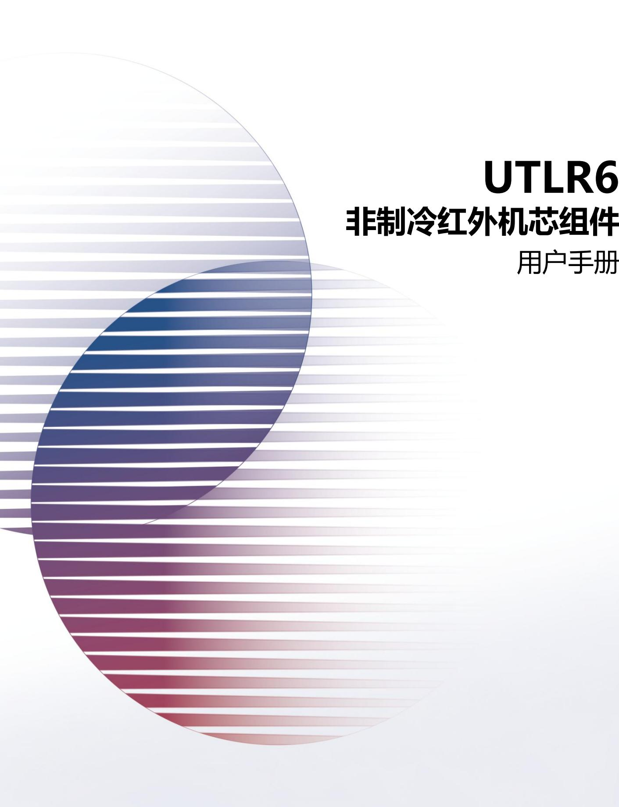

#### 版本历史

| 版本     | 时间      | 说明                                             |
|--------|---------|------------------------------------------------|
| V1.0.0 | 2025-08 | 初始版本                                           |
| V1.0.1 | 2025-09 | 修改 MIPI 接口板的线序,16pin 和 20pin 为电源地              |
| V1.0.3 | 2025-10 | 修改 PAL 无变倍的描述; 串行通信接口中,增加 CML 接口板使用 232 串口; |
|        |         |                                                |
|        |         |                                                |
|        |         |                                                |
|        |         |                                                |
|        |         |                                                |
|        |         |                                                |
|        |         |                                                |
|        |         |                                                |
|        |         |                                                |

# 目录

| 1 | 产品描述                    | 1  |
|---|-------------------------|----|
| 2 | 产品选型表                   | 1  |
| 3 | 产品性能参数                  | 2  |
| 4 | 机芯组件用户接口说明              | 4  |
|   | 4.1 无用户扩展组件             | 4  |
|   | 4.2 Cameralink 用户扩展组件   | 5  |
|   | 4.3 CML 用户扩展组件          | 6  |
|   | 4.4 USB 用户扩展组件          | 7  |
|   | 4.5 MIPI 用户扩展组件         | 7  |
| 5 | 数字视频接口说明                | 8  |
|   | 5.1 CML 格式              | 8  |
|   | 5.2 BT656 数字视频          | 9  |
|   | 5.2.1 BT656 隔行数字视频      | 10 |
|   | 5.2.2 BT656 逐行数字视频      | 12 |
|   | 5.3 DVP/Cameralink 数字视频 | 13 |
|   | 5.4 USB 数字视频            | 15 |
|   | 5.5 MIPI 数字视频           | 15 |
| 6 | 同步模式说明                  | 16 |
| 7 | 积分时间说明                  | 16 |
| 8 | 镜头选配件说明                 | 17 |

| 9 扩展组件线序定义            | 18 |
|-----------------------|----|
| 9.1 无用户扩展组件           | 18 |
| 9.2 Cameralink 用户扩展组件 | 20 |
| 9.3 CML 用户扩展组件        | 20 |
| 9.4 USB 用户扩展组件        | 21 |
| 9.5 MIPI 用户扩展组件       | 21 |
| 10 结构尺寸               | 22 |
| 11 指令集                | 28 |
| 11.1 常用功能             | 28 |
| 11.2 高级功能             | 29 |
| 11.3 信息查询指令           | 32 |
| 12 注意事项               | 33 |
| 13 支持与服务              | 35 |
| 13.1 技术支持             | 35 |
| 13.2 售后服务             | 35 |

#### **1 产品描述**

UTLR6 非制冷红外机芯组件是一款小尺寸、轻量级以及低功耗产品。其支持多种 串行通信和视频输出接口,同时可提供多种轻量化的红外镜头可供选择。本产品具有 良好的抗振动抗冲击性能,可为各种小型手持望远镜、头盔夜视设备、轻型无人飞行 器系统以及多种融合光电系统等,提供完善的红外成像解决方案。同时可满足光电吊 舱、车载应用、瞄具等对可靠性要求较高的产品开发需求。

# **2 产品选型表**

表 1 产品选型表

| 选型信息   |               |  |
|--------|---------------|--|
| 机芯型号   | 640×512       |  |
| 帧频     | 50Hz          |  |
|        | 00:无扩展组件      |  |
|        | 01:Cameralink |  |
| 用户扩展组件 | 02:CML        |  |
|        | 05:USB        |  |
|        | 07:mipi       |  |
|        | 无镜头           |  |
|        | 19mm F1.0     |  |
| 镜头     | 25mm F1.0     |  |
|        | 35mm F1.0     |  |
|        | 55mm F1.0     |  |

#### 注:

①产品命名规则是对产品型号的解释,实际以超睿光电提供为准,产品具体选型敬请咨询市场销售人员或 技术支持;

# **3 产品性能参数**

表 2 技术参数(1)

| 性能指标         |                                    |  |
|--------------|------------------------------------|--|
| 探测器类型        | 氧化钒非制冷红外焦平面探测器                     |  |
| 分辨率          | 640×512                            |  |
| 像元间距         | 12μm                               |  |
| 探测器帧频        | 50Hz                               |  |
| 响应波段         | 8~14μm                             |  |
| 噪声等效温差(NETD) | <35mK @25℃,F#1.0                   |  |
| 图像调节         |                                    |  |
| 极性           | 黑热/白热(默认)                          |  |
| 亮度、对比度调节     | 可手动调节亮度/对比度                        |  |
| 伪彩(2)        | 支持                                 |  |
| 十字分划         | 显示/消隐(默认)/移动                       |  |
|              | 非均匀性校正                             |  |
| 图像处理         | 数字滤波降噪                             |  |
|              | 数字细节增强                             |  |
| 电子变倍         | 1.0~8.0x 连续变倍(步长 0.1)              |  |
| 图像镜像(3)      | 左右/上下/对角线                          |  |
| 电源           |                                    |  |
|              | 无用户扩展板支持 4±0.1V DC                 |  |
|              | Cameralink 接口板支持 5~18V DC          |  |
| 供电范围         | CML 接口板支持 4±0.1V DC                |  |
|              | USB 接口板支持 5V DC                    |  |
|              | MIPI 接口板支持 4±0.1V DC(默认)或可定制 5~18V |  |
| 典型功耗@25℃     | 无用户扩展板功耗≤1W                        |  |
|              | 含用户扩展板功耗≤2W                        |  |
| 绝缘           | 机壳地与信号地、电源地绝缘,绝缘电阻>20MΩ            |  |

| 接口参数     |         |                              |
|----------|---------|------------------------------|
|          | 模拟视频    | 1 路 PAL 制式(仅支持调试)            |
| 视频输出(5)  | 数字视频(4) | Cameralink、CML、USB、MIPI      |
|          |         | UART(无扩展组件,MIPI 接口板,USB 接口板) |
| 串行通信接口   |         | RS422(Cameralink 接口板)        |
|          |         | RS232(CML 接口板)               |
| 物理特性     |         |                              |
| 尺寸(无镜头)  |         | 26mm×26mm                    |
|          |         | 24.5±3g(带扩展板)                |
| 重量(无镜头)  |         | 19.5±3g(无扩展板)                |
| 环境适应性    |         |                              |
| 工作温度     |         | -40℃~+60℃                    |
| 存储温度     |         | -50℃~+75℃                    |
| 振动       |         | 6.06g,随机振动,所有轴               |
| 冲击       |         | 80g,6ms,后峰锯齿波,三轴六向           |
| 高冲击性     |         | 1000g,0.3ms,光轴方向             |
| 功能       |         |                              |
| 自检(6)    |         | 具备收令自检功能                     |
| 开机时间     |         | ≤9s                          |
| 快门校正时间   |         | ≤1.5s                        |
| 外同步功能(7) |         | 单端外同步(LVTTL 3.3V),只支持外同步输入   |
| 串口升级     |         | 具备串口升级固件的功能                  |
| 强光保护     |         | 强光保护功能(默认关)                  |

#### 注:

- (1) 常温测试环境为:温度 23~25℃,湿度 50~55%RH,标准大气压 101.325kPa,不带镜头;
- (2) 模拟视频、CML 不支持伪彩; 在数字视频开启时,PAL 输出不具备变倍功能;

- (3) 数据流延时最大 2 帧;上下/对角镜像有 1 帧延时,左右镜像无延时;由于带宽受限,图像镜像设置上下 或对角线时电子变倍只支持 1~2.4X,电子变倍设置 2.5~8X 时图像镜像只支持关或左右镜像;
- (4) CML 数字视频,8bit 数据支持黑/白热,14bit 数据不支持;且无伪彩功能;8bit 不支持变倍;
- (5) 视频模式切换,需机芯重新上电后生效。
- (6) 自检功能,实现对探测器、FLASH、温度传感器的自检
- (7) 外同步:外同步输入指机芯接收外同步信号进行工作,目前支持固定 50Hz 帧频;外同步输出指机芯按工 作帧频输出外同步信号;自适应指机芯上电 1s 内,收到外同步信号,则按外同步模式工作,否则按普通工 作模式工作,既不接收外同步信号,也不输出外同步信号;

## **4 机芯组件用户接口说明**

机芯组件可提供无扩展板接口,Cameralink、CML、USB、MIPI 扩展组件接口 板。

#### **4.1 无用户扩展组件**

无用户扩展组件采用 3630-P070-011G1R01(广东维峰电子有限公司)70 芯连 接器,包含机芯组件供电接口、DVP 数字视频信号接口、PAL 模拟视频信号接口、UART 串行通信接口、外同步接口与 1.8V/3.3V 电平标准通用可编程 GPIO。建议用户采用 3630-S070-029G1R01(广东维峰电子有限公司)连接器与本机芯组件进行对接,如 图 1 所示。

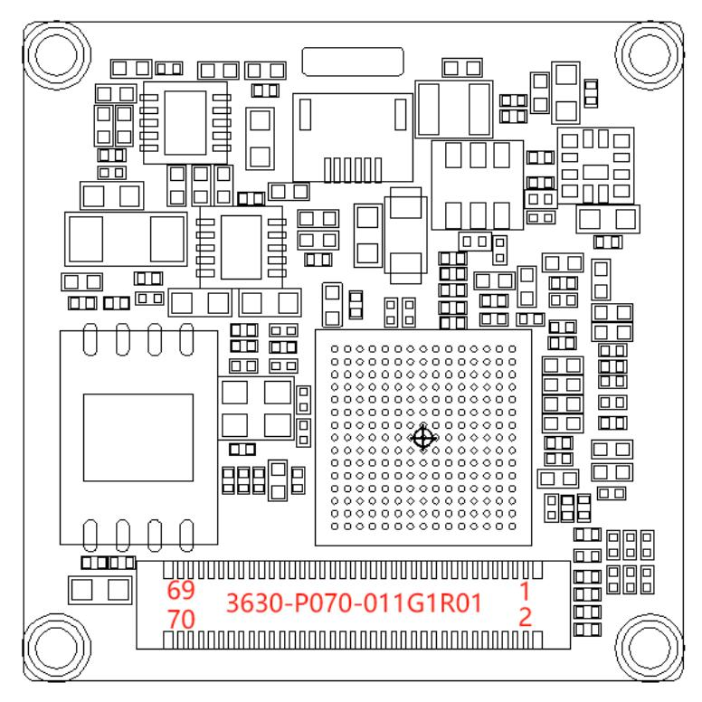

图 1 电气接口图

#### **4.2 Cameralink 用户扩展组件**

Cameralink 用户扩展组件对外接口采用国产连接器厂家广东胜蓝电子科技有限 公司生产的 11006W90-2X12P-S-5AE-NK-R 连接器,对插连接器型号为 11006H00-2X12P-L1-HF,如下图 2 所示。

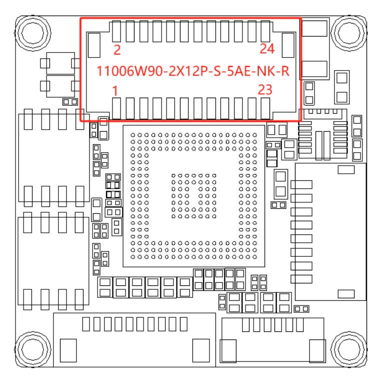

图 2 电气接口图

#### **4.3 CML 用户扩展组件**

CML 用户扩展组件采用焊接甩线设计,焊接位置图如下:

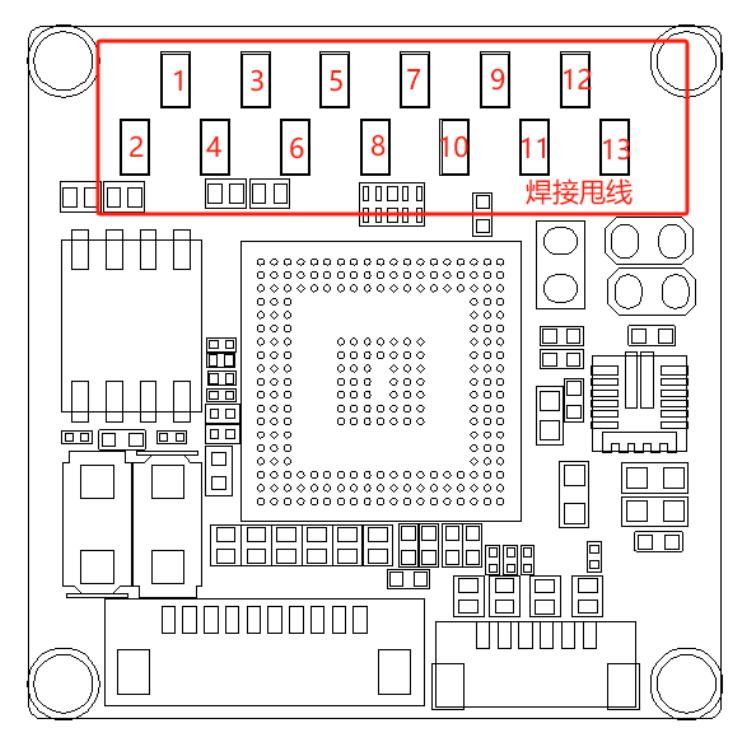

图 3 焊接位置图

#### **4.4 USB 用户扩展组件**

USB 用户扩展组件深圳长江连接器有限公司的 A1002WR-S-4P,对插连接器型号 为 A1002H-4P,电气接口图如下图 4 所示。

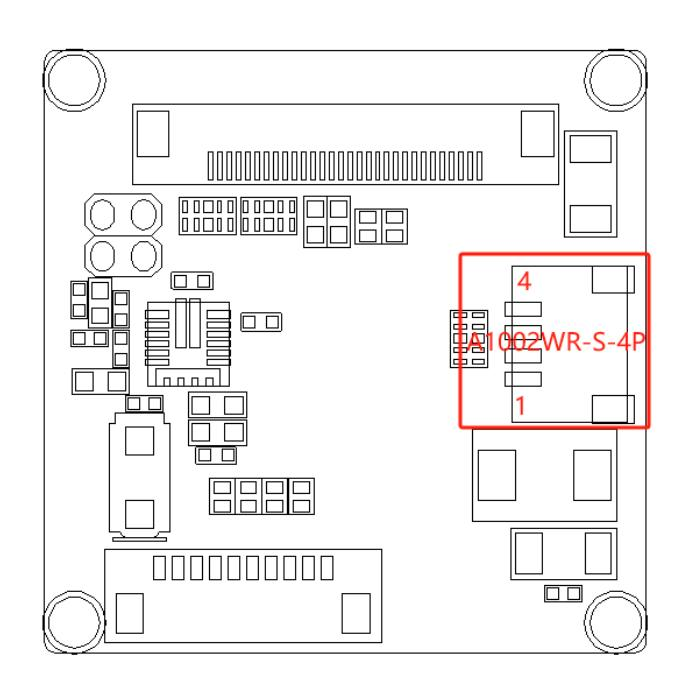

图 4 电气接口图

# **4.5 MIPI 用户扩展组件**

MIPI 用户扩展组件采用昆山旺德海电子科技有限公司的 ZHJ50463-0304A-001, 对插连接器型号为 50464-0300A(20373),其电气接口如下:

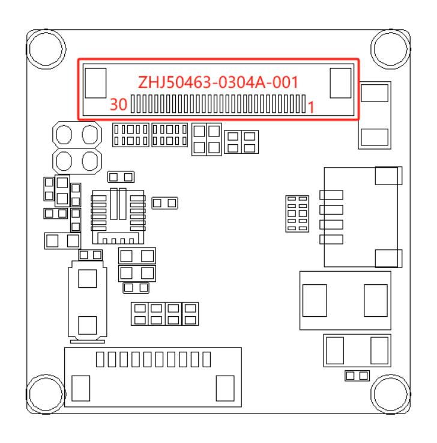

图 5 电气接口图

# **5 数字视频接口说明**

数字视频输出接口中,各数字视频可通过上位机指令切换。

# **5.1 CML 格式**

ISP 输出视频格式为 DVP,包括两部分:左边部分大小为 320\*512,输出 8bit, 数据源经过算法模块处理后的图像,图像格式为 Y\_ONLY;右边部分大小为 640\*512, 输出 16bit,数据源未经过算法模块处理后的图像,图像格式为 Y\_ONLY。

CML 视频不支持伪彩和黑白热切换,默认为白热模式。

CML 时序(640 面阵 960×512 分辨率)

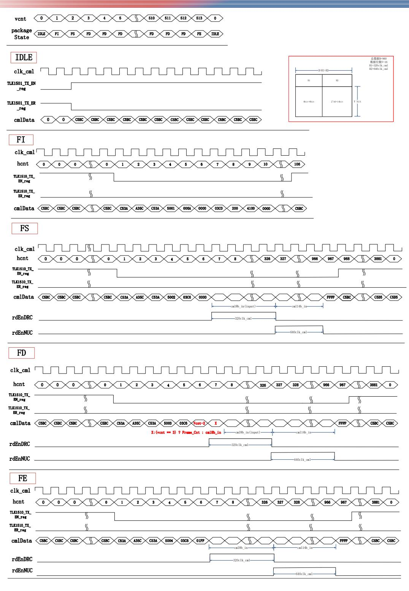

图 6 CML 时序图

#### 5.2 BT656 数字视频

BT656视频不需要帧同步信号和行同步信号,只需要1个时钟信号和8个数据线。

BT656 视频按照数据的排列方式可以分为逐行方式和隔行方式。目前隔行模式下 机芯中输出总的面阵为 720×576,帧频为 25Hz。逐行输出时面阵同样为 720×576, 帧频为 50Hz。

注意:自研 BT656 用户板时请注意,因时钟速率较高,部分线缆线损较多,建议 在用户板时钟管脚处增加 3.3V 的上拉。

## **5.2.1 BT656 隔行数字视频**

隔行输出,即第 1、3、5……等行的数据为奇数场数据排在一起输出,而第 2、4、 6……等行的数据为偶数场数据排在一起输出,一帧的数据没有按照行号依次排列,具 体输出如下所示:

产品类别 时钟频率 UTLR6 27MHz 图 7 BT656 隔行时序图

表 9 BT656 时钟频率

BT656 视频每一行数据中包含了基准码(EAV/SAV)、消隐区(Blanking)、数据区 (Active Video)等三个部分,数据有效的行称为有效行,数据无效的行称为无效行。 BT656 视频没有行场同步信号,需要在 8 位数据中加入行与帧的标志位,以表征该行 或帧数据的起始或结束。这些标志位称之为同步基准码。每行包含 1728 个字节的数 据,数据由水平控制信号和 YCbCr 视频数据信号组成,并以 Cb-Y-Cr-Y 的顺序排列, 一行的前 288 字节是行控制信号,其以4字节的有效视频结束信号开始,以"EAV" 表示,其后是 140 个"80、10"固定数据,共 280 字节,最后是4字节的有效视频 起始信号,用"SAV"表示。水平控制信号后是有效视频数据,共 1440 字节。偶数 场与奇数场均为 288 行×720 像素点的图像,BT656 图像整场为 576 行×720 像素点 的图像。

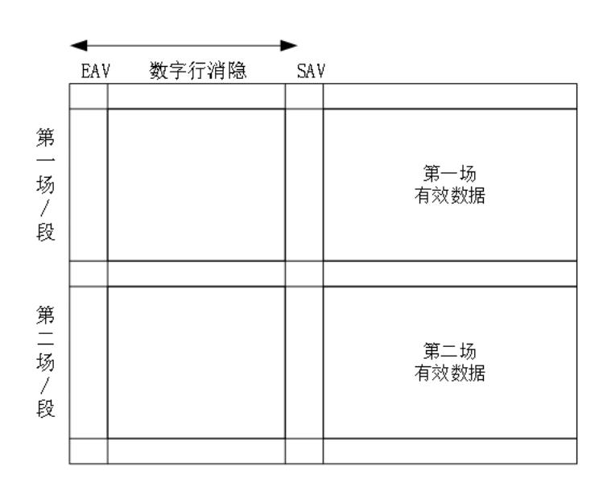

图 8 隔行系统和分段系统中的场/段定时关系示意图

#### 具体输出参考图 9:

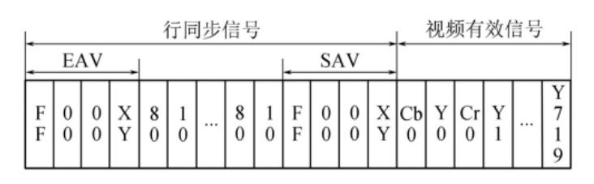

图 9 有效行输出数据

"FF、00、00"是 SAV 和 EAV 信号 3 字节的前引,最后一字节"XY"用于辨 别该行位于整个数据帧的位置,还能准确区分 SAV、EAV 信号。"XY"字节各比特位 含义如表 12所示。其中:F=0 表示偶数场,F=1 表示奇数场;V=0 表示该行含有 效视频数据,V=1 表示该行无有效视频数据;H=0 表示为 SAV 信号,H=1 表示为 EAV 信号; P3~P0 是保护信号,通过 F、V、H 三个信号异或生成,P3=V xor H,P2=F xor H,P1=F xor V,P0=F xor V xor H,后续的同步头检测部分就是基于此来实现的。具体参数如下所示:

表 3 BT656 同步头定义

| bit   | 7 | 6 | 5 | 4 | 3       | 2       | 1       | 0             |
|-------|---|---|---|---|---------|---------|---------|---------------|
| value | 1 | F | V | Н | V xor H | F xor H | F xor V | F xor V xor H |

表 4 BT656 隔行数据每帧分布

|         | 110.22.000 |    |    |         |                  |     |       |     |            |                  |
|---------|------------|----|----|---------|------------------|-----|-------|-----|------------|------------------|
|         | 0          | 1  | 2  | 3       | 4-283            | 284 | 285   | 286 | 287        | 288-1727         |
| Line    | EAV        |    |    | Invalid |                  |     | Valid |     |            |                  |
| 0-21    | FF         | 00 | 00 | В6      |                  | FF  | 00    | 00  | AB         | Y:10 Cb/Cr:80 |
| 22-309  | FF         | 00 | 00 | 9D      | Y:80 Cb/Cr:10 | FF  | 00    | 00  | 80         | YCbCr            |
| 310-311 | FF         | 00 | 00 | В6      |                  | FF  | 00    | 00  | AB         | Y:10 Cb/Cr:80 |
| 312-334 | FF         | 00 | 00 | F1      |                  | FF  | 00    | 00  | EC         | Y:10 Cb/Cr:80 |
| 335-622 | FF         | 00 | 00 | DA      |                  | FF  | 00    | 00  | <b>C</b> 7 | YCbCr            |
| 623-624 | FF         | 00 | 00 | F1      |                  | FF  | 00    | 00  | EC         | Y:10 Cb/Cr:80 |

数据输出有效数据为 640×512 面阵居中显示,剩余部分填黑边。

# 5.2.2 BT656 逐行数字视频

逐行输出,即数据按照行号依次输出,通过改变时钟对输出帧频进行更改。

表 5 BT656 时钟频率

| · ·   |       |
|-------|-------|
| 产品类别  | 时钟频率  |
| UTLR6 | 54MHz |

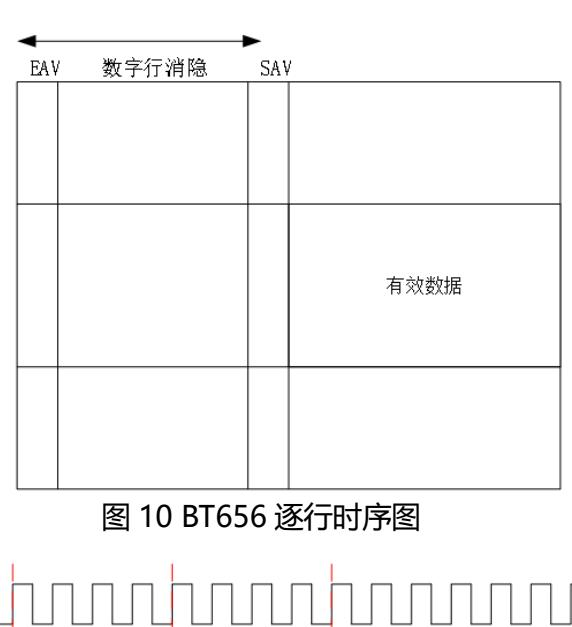

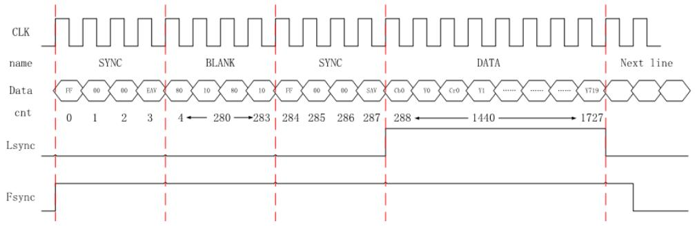

图 11 逐行系统中的帧定时关系示意图

表 6 逐行系统中的帧定时关系

|         | 0     | 1  | 2  | 3       | 4-283            | 284 | 285 | 286 | 287   | 288-1727         |
|---------|-------|----|----|---------|------------------|-----|-----|-----|-------|------------------|
| Line    | e EAV |    |    | Invalid | SAV              |     |     |     | Valid |                  |
| 0-21    | FF    | 00 | 00 | В6      | V 00             | FF  | 00  | 00  | AB    | Y:10 Cb/Cr:80 |
| 22-597  | FF    | 00 | 00 | 9D      | Y:80 Cb/Cr:10 | FF  | 00  | 00  | 80    | YCbCr            |
| 598-624 | FF    | 00 | 00 | В6      |                  | FF  | 00  | 00  | AB    | Y:10 Cb/Cr:80 |

与隔行相同,该有效数据也为 640×512 面阵居中显示,剩余部分填黑边。

# 5.3 DVP/Cameralink 数字视频

机芯组件支持输出 DVP/Cameralink 数字视频,该数字视频包括 1 个时钟信号 (Clock)、1 个行有效信号(Line\_Valid),1 个帧有效信号(Frame\_Valid) ,以及 8 个数据信号(DV8- DV15)。

表 7 DVP/Cameralink 时钟频率

| 产品型号  | 时钟频率(Clock) |  |  |  |  |
|-------|-------------|--|--|--|--|
| UTLR6 | 22.5MHz     |  |  |  |  |

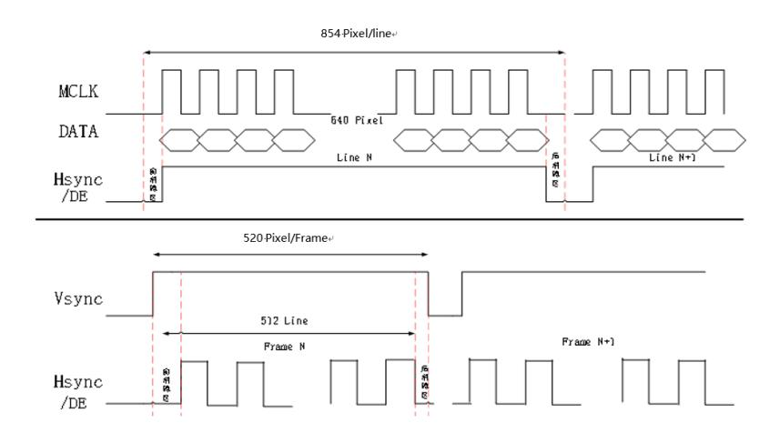

图 12 DVP/Cameralink 数字视频时序图

表 8 DVP/Cameralink 时序说明

| 编号 | 信号    | 说明  | 备注                                            |
|----|-------|-----|-----------------------------------------------|
| 1  | MCLK  | 时钟  | 22.5MHz                                       |
| 2  | DATA  | 数据  | 有效数据640列×512行                                 |
| 3  | Hsync | 行同步 | 一行共854个时钟,其中640个时钟对应有效数据位,剩余214 个时钟对应消隐数据位 |
| 4  | Vsync | 帧同步 | 一帧共520行,其中512行为有效行,剩余8行为消隐行                   |
| 5  | DE    | 使能  | 与Hsync一致                                      |

DVP/Cameralink 视频数据每一个像素的数据对应 1 个时钟周期。每一帧的数据 量与机芯探测器的面阵大小相同,机芯探测器面阵大小为 640\*512,DVP 每一帧包含 640\*512=327680 个像素的数据,每行有 640 个数据,共有 512 行。即每个行同步 信号高电平持续的时间为 640 个时钟周期,在一帧数据期间,行同步信号共有 512 次被置为高电平。在上图中,同步信号和数据信号都是在时钟的上升沿进行变化,在 实际的程序设计中,可以令信号在时钟的下降沿开始变化,以便于接收端在时钟的上

升沿进行采样。

#### **5.4 USB 数字视频**

标准 USB2.0 接口,支持 USB UVC BULK 输出图像,YUV422 输出,默认输出 50Hz。

#### **5.5 MIPI 数字视频**

MIPI 数字视频采用 CSI-2 标准 2lane 协议,包括一对差分时钟信号与两对差分 数据信号,时序图如图 13 所示。时钟与数据信号在每帧内为高速模式,在帧间为低 功耗模式。640\*512 面阵的时钟配置为 420MHz。

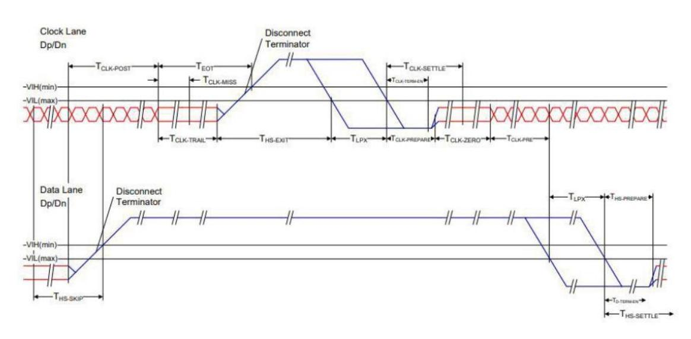

图 13 CSI-2 标准 2line 协议 MIPI 时序图

机芯上电启动后开始输出 MIPI 数字视频,以 640\*512 为例,输出的数据格式为 YUV422-8bit(标准 MIPI CSI-2 协议),面阵应设置为(640\*2)\*512,需后端自 行拼接为 640\*512\*16bit 数据。一行有效数据的前 640\*16bit 为图像数据(先 Y 后 UV,Y→U→Y→V),如图 14 所示。YUV 的顺序可以通过串口指令配置,详见通讯 协议:YUV 顺序设置。

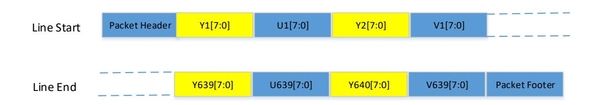

图 14 MIPI YUV422 8bit 行数据示意图

## **6 同步模式说明**

机芯根据设定的外同步模式相应工作,上升沿有效,高电平持续时间大于 1.6ms, 外同步输出模式下输入频率 50±0.1Hz。幅值 3.3V,占空比 8%。外同步输入模式时, 若不提供外同步信号,机芯将卡死,产生外同步信号的设备必须与机芯组件信号地共 地,建议使用方波信号。

| 外同步模式 | 工作方式                                                           | 频率   |
|-------|----------------------------------------------------------------|------|
| 关     | 机芯正常工作,但不响应输入外同步信号,也不输出外同步信号                                   | 50Hz |
| 外同步输出 | 机芯正常工作,不响应输入外同步信号,但输出外同步信号(CML、CMLK不支持)                        | 50Hz |
| 外同步输入 | 无外同步信号输入时机芯卡死,有外同步信号输入时机芯正常工作                                  | 50Hz |
| 自适应   | 无外同步信号输入时机芯卡死,有外同步信号输入时机芯正常工作,若等待一段时 间仍无外同步信号输入将关闭外同步模式避免卡死 | 50Hz |

表 9 外同步模式说明

# **7 积分时间说明**

非制冷探测器采用的是行积分(曝光)方式,单行积分时间计算公式如下: Tint=(INT\_TIME\*32+16)\*TMCK;

其中,UTLR6 INT\_TIME 默认设置为 70,TMCK 为(1/75MHz);

注:积分时间与模拟 reset 时间相加之和需要比行周期小 2μs 左右。

## **8 镜头选配件说明**

表 10 镜头参数

| 机芯型号  | 阵列规模    | 镜头类型 | 焦距   | 光圈   | HFOV×VFOV   | IFOV     |
|-------|---------|------|------|------|-------------|----------|
|       |         | 无热化  | 19mm | F1.0 | 22.9°×18.4° | 0.63mrad |
|       |         |      | 25mm | F1.0 | 17.4°×14°   | 0.48mrad |
| UTLR6 | 640×512 |      | 35mm | F1.0 | 12.5°×10°   | 0.34mrad |
|       |         |      | 55mm | F1.0 | 8°×6.4°     | 0.22mrad |

#### **扩展组件线序定义**

#### **9.1 无用户扩展组件**

接口定义如下表 11 所示:

表 11 连接器接口定义

| 引脚序号                                         | 引脚名称        | 类型   | 说明                      |  |
|----------------------------------------------|-------------|------|-------------------------|--|
| 65,66,67,68,69,70                            | Main_Power  | 电源   | 电源输入(4±0.1V DC)         |  |
| 1,2,4,7,13,19,20,25,26,49,5 2,61,62,63,64 | GND         | 电源   | 电源地                     |  |
| 6                                            | UART2_RX_P  | 输入   | UART2通信接口(3.3V),此串口支持   |  |
| 8                                            | UART2_TX_P  | 输出   | 内部调试,不支持串口通信与串口更新       |  |
| 10                                           | UART1_RX_P  | 输入   | UART1通信接口(3.3V),此串口支持   |  |
| 12                                           | UART1_TX_P  | 输出   | 串口通信,不支持串口更新            |  |
| 14                                           | UART0_RX_P  | 输入   | UART0通信接口(3.3V),此串口支持   |  |
| 16                                           | UART0_TX_P  | 输出   | 串口通信与串口更新               |  |
| 18                                           | NC          | 禁止连接 | 禁止连接                    |  |
| 54                                           | SWD_CLK     | 输出   |                         |  |
| 56                                           | SWD_IO      | 输入   | JTAG接口(3.3V)            |  |
| 53                                           | WM_ROM ONLY | 输出   |                         |  |
| 28                                           | DVP0        | 输出   |                         |  |
| 31                                           | DVP1        | 输出   |                         |  |
| 30                                           | DVP2        | 输出   |                         |  |
| 33                                           | DVP3        | 输出   |                         |  |
| 32                                           | DVP4        | 输出   | DVP/BT656并行数字视频信号(3.3V) |  |
| 35                                           | DVP5        | 输出   | 8bit默认高八位DVP[8:15]      |  |
| 34                                           | DVP6        | 输出   |                         |  |
| 37                                           | DVP7        | 输出   |                         |  |
| 36                                           | DVP8        | 输出   |                         |  |

| 39 | DVP9        | 输出    |                   |  |
|----|-------------|-------|-------------------|--|
| 38 | DVP10       | 输出    |                   |  |
| 41 | DVP11       | 输出    |                   |  |
| 40 | DVP12       | 输出    |                   |  |
| 43 | DVP13       | 输出    |                   |  |
| 42 | DVP14       | 输出    |                   |  |
| 45 | DVP15       | 输出    |                   |  |
| 44 | DVP_VSYNC   | 输出    | 帧同步信号(3.3V)       |  |
| 47 | DVP_CLK     | 输出    | 时钟信号(3.3V)        |  |
| 46 | DVP_DE      | 输出    | 数据使能信号(3.3V)      |  |
| 29 | DVP_HSYNC   | 输出    | 行同步信号(3.3V)       |  |
| 48 | NC          | 禁止连接  | 禁止连接              |  |
| 50 | DVP_FSYNC1  | 输入/输出 | 外同步(3.3V)         |  |
| 22 | USB_DP      | 输入/输出 | USB差分数据P          |  |
| 24 | USB_DM      | 输入/输出 | USB差分数据M          |  |
| 58 | NC          | 输入/输出 | ISP复位信号(3.3V)禁止连接 |  |
| 51 | GPIO07      | 输入/输出 | 通用可编程输入输出接口(1.8V) |  |
| 60 | GPIO03      | 输入/输出 | 通用可编程输入输出接口(3.3V) |  |
| 5  | VIDEO_GND   | 输出    | 模拟视频地             |  |
| 3  | VIDEO       | 输出    | 模拟视频              |  |
| 55 | GPIO05      | 输入/输出 | 通用可编程输入输出接口(3.3V) |  |
| 57 | GPIO10      | 输入/输出 | 通用可编程输入输出接口(1.8V) |  |
| 59 | GPIO11      | 输入/输出 | 通用可编程输入输出接口(1.8V) |  |
| 27 | NC          | 禁止连接  | 禁止连接              |  |
| 9  | MIPI_DATA0- | 输出    |                   |  |
| 11 | MIPI_DATA0+ | 输出    | MIPI数据信号0         |  |
| 21 | MIPI_CLK-   | 输出    |                   |  |
| 23 | MIPI_CLK+   | 输出    | MIPI时钟信号          |  |
| 15 | MIPI_DATA1- | 输出    | MIPI数据信号1         |  |
|    |             |       |                   |  |

| 17 | MIPI_DATA1+ | 输出 |  |
|----|-------------|----|--|

#### **9.2 Cameralink 用户扩展组件**

#### 接口定义如下表所示:

表 12 CMLK 扩展板接口定义

| 引脚序号     | 引脚名称         | 类型    | 说明          |
|----------|--------------|-------|-------------|
| 1,3,5    | SUPPLY_POWER | 电源    | 电源输入(5~18V) |
| 2,4,6,12 | GND          | 电源    | 电源地         |
| 7        | RS422_TX+    | 输出    |             |
| 9        | RS422_TX-    | 输出    |             |
| 11       | RS422_RX+    | 输入    | RS422通讯接口   |
| 13       | RS422_RX-    | 输入    |             |
| 8        | VIDEO        | 输出    | 模拟视频        |
| 10       | VIDEO_GND    | 输出    | 模拟视频地       |
| 15       | CMLK_TX0+    | 输出    | 差分数据 DATA0+ |
| 17       | CMLK_TX0-    | 输出    | 差分数据 DATA0- |
| 14       | CMLK_TX1+    | 输出    | 差分数据 DATA1+ |
| 16       | CMLK_TX1-    | 输出    | 差分数据 DATA1- |
| 19       | CMLK_TX2+    | 输出    | 差分数据 DATA2+ |
| 21       | CMLK_TX2-    | 输出    | 差分数据 DATA2- |
| 18       | CMLK_TX3+    | 输出    | 差分数据 DATA3+ |
| 20       | CMLK_TX3-    | 输出    | 差分数据 DATA3- |
| 22       | CMLK_CLK+    | 输出    | 差分时钟 CLK+   |
| 24       | CMLK_CLK-    | 输出    | 差分时钟 CLK    |
| 23       | EXT_SYNC     | 输入/输出 | 外同步(3.3V)   |

# **9.3 CML 用户扩展组件**

焊盘定义见表 13:

表 13 CML 扩展板焊盘定义

| 焊盘序号 | 焊盘名称  | 引脚名称                    | 类型                 | 说明            |
|------|-------|-------------------------|--------------------|---------------|
| TP1  | RX+   | RS422_RX+               | 输入                 |               |
| TP2  | RX-   | RS422_RX-               | 输入                 | RS232通讯接口     |
| TP3  | TX+   | RS422_TX+ (RS232_TX) | RS422输出 RS232输出 | (预留RS422通讯接口) |
| TP4  | TX    | RS422_TX- (RS232_RX) | RS422输出 RS232输入 |               |
| TP5  | GND   | GND                     | 电源                 | 电源地           |
| TP6  | SYNC  | EXT_SYNC                | 输入/输出              | 外同步(3.3V)     |
| TP7  | CML+  | CML_P                   | 输出                 | CML差分数据P      |
| TP8  | CML-  | CML_N                   | 输出                 | CML差分数据N      |
| TP10 | GND   | GND                     | 电源                 | 电源地(CML地)     |
| TP9  | AGND  | VIDEO_GND               | 输出                 | 模拟视频地         |
| TP11 | VIDEO | VIDEO                   | 输出                 | 模拟视频          |
| TP12 | GND   | GND                     | 电源                 | 电源地           |
| TP13 | VCC   | SUPPLY_POWER            | 电源                 | 电源输入(默认4V)    |

#### **9.4 USB 用户扩展组件**

表 14 USB 扩展板接口定义

| 引脚序号 | 引脚名称         | 类型 | 说明     |  |
|------|--------------|----|--------|--|
| 1    | USB_VBUS     | 电源 | 电源输入   |  |
| 2    | GND          | 电源 | 电源地    |  |
| 3    | USB_DP       | 输出 |        |  |
| 4    | USB_DM 输出 |    | USB2.0 |  |

# **9.5 MIPI 用户扩展组件**

接口定义如下表 15 所示:

表 15 MIPI 扩展板接口定义

| 引脚序号        | 引脚名称        | 类型 | 说明                 |  |
|-------------|-------------|----|--------------------|--|
| 1,2,3,4,5,6 | VIN+        | 电源 | 4V±0.1输入(可定制5~18V) |  |
| 7,8,9,10,11 | GND         | 电源 | 电源地                |  |
| 12          | UART0_RX    | 输入 | 串口,机芯端RX           |  |
| 13          | UART0_TX    | 输出 | 串口,机芯端TX           |  |
| 14          | GND         | 电源 | 电源地                |  |
| 15          | FSYNC       | 输出 | 外同步输入/输出           |  |
| 16          | GND         | 电源 | 电源地                |  |
| 17,19       | VIDEO_GND   | 电源 | 模拟视频地              |  |
| 18          | VIDEO       | 输出 | 模拟视频               |  |
| 20          | GND         | 电源 | 电源地                |  |
| 21          | GND         | 电源 | 电源地                |  |
| 22          | MIPI_DATA1+ | 输出 | MIPI,红外lan1+       |  |
| 23          | MIPI_DATA1- | 输出 | MIPI,红外lan1-       |  |
| 24          | GND         | 电源 | 电源地                |  |
| 25          | MIPI_DATA0+ | 输出 | MIPI,红外lan0+       |  |
| 26          | MIPI_DATA0- | 输出 | MIPI,红外lan0-       |  |
| 27          | GND         | 电源 | 电源地                |  |
| 28          | MIPI_CLK+   | 输出 | MIPI,红外时钟+         |  |
| 29          | MIPI_CLK-   | 输出 | MIPI,红外时钟          |  |
| 30          | GND         | 电源 | 电源地                |  |

### **结构尺寸**

UTLR6 的结构尺寸如下图所示。

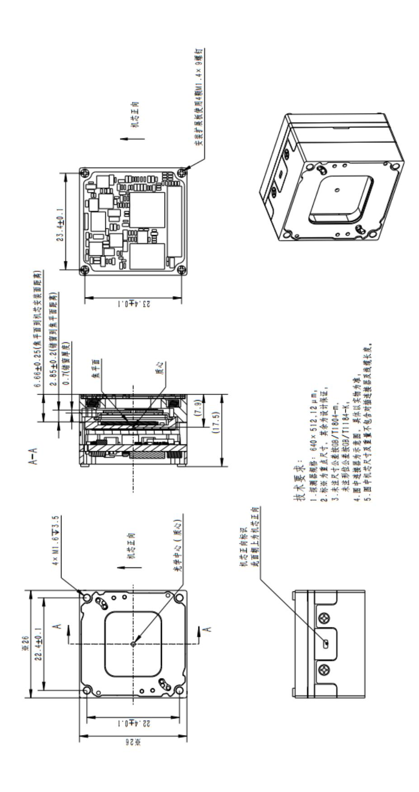

图 15 无扩展板状态结构尺寸图

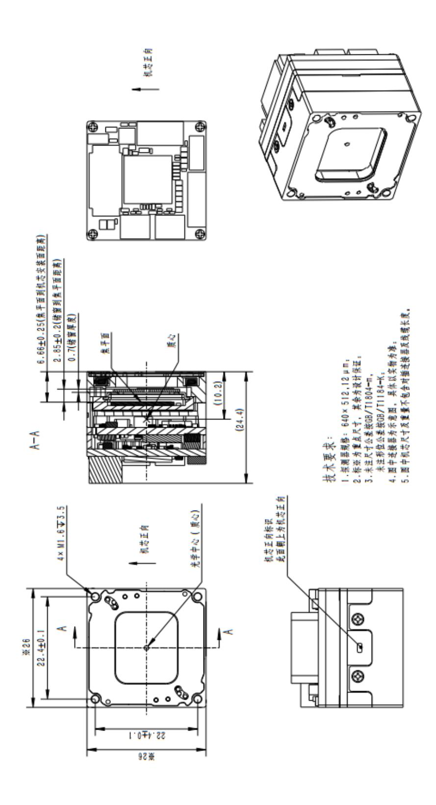

图 16 CMLK 扩展板状态结构尺寸图

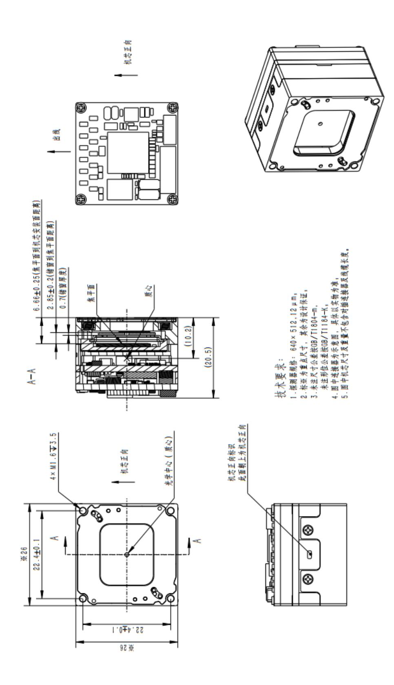

图 17 CML 扩展板状态结构尺寸图

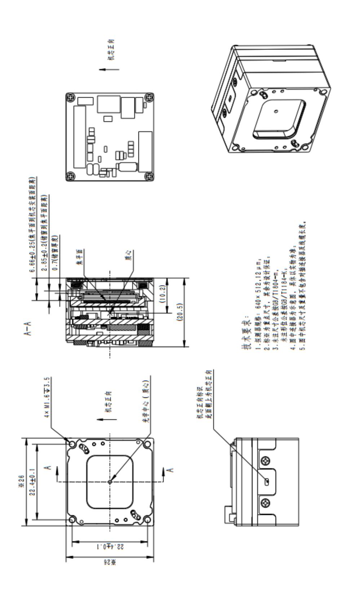

图 18 USB 扩展板状态结构尺寸图

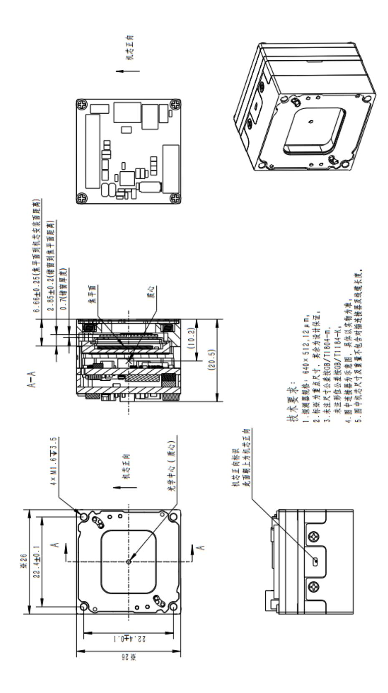

图 19 MIPI 扩展板状态结构尺寸图

#### **11 指令集**

机芯使用通用 UART 通讯接口,8 位数据位,无校验位,1 位停止位。默认波特 率 115200bps。

# **11.1 常用功能**

表 16 常用功能指令

| 功能      |    | 指令                                    | 备注            |
|---------|----|---------------------------------------|---------------|
| 自动/手动校正 | 接收 | 自动校正:AA 05 01 01 01 01 B3 EB AA       |               |
|         |    | 手动校正:AA 05 01 01 01 00 B2 EB AA       |               |
|         | 返回 | 55 04 01 33 01 8E EB AA               |               |
|         |    | 背景校正:AA 05 01 02 02 00 B4 EB AA       |               |
| 背景/快门校正 | 接收 | 双稳态快门校正:AA 05 01 02 02 01 B5 EB AA    |               |
|         | 返回 | 55 04 02 33 01 8F EB AA               |               |
|         | 接收 | AA 04 01 C3 00 72 EB AA               | X2为高位,X1为低    |
| FPA温度查询 | 返回 |                                       | 位,X3为校验和,查    |
|         |    | 55 05 C3 33 X1 X2 X3 EB AA            | 询值为实际100倍     |
| 保存设置    | 接收 | AA 04 01 7F 02 30 EB AA               |               |
|         | 返回 | 55 04 7F 33 01 0C EB AA               |               |
| 恢复出厂默认  | 接收 | AA 05 01 82 02 00 34 EB AA            |               |
| 参数      | 返回 | 55 04 82 33 01 0F EB AA               |               |
|         |    | DVP&CMLK: AA 05 01 B4 01 00 65 EB AA  | 操作顺序          |
|         |    | PAL: AA 05 01 B4 01 01 66 EB AA       | 1)配置出图类型      |
|         |    | MIPI: AA 05 01 B4 01 02 67 EB AA      | 2)视频编码方式切     |
|         | 接收 | BT656隔行: AA 05 01 B4 01 03 68 EB AA   | 换             |
| 视频格式切换  |    | BT656逐行: AA 05 01 B4 01 04 69 EB AA   | 3)保存          |
|         |    | USB输出50Hz: AA 05 01 B4 01 05 6A EB AA |               |
|         |    | CML:AA 05 01 B4 01 06 6B EB AA        |               |
|         | 返回 | 55 04 B4 33 01 41 EB AA               |               |
| 数据源切换   | 接收 | 8bit: AA 05 01 BC 01 00 6D EB AA      | BT656、MIPI输出格 |

| 功能       |    | 指令                                                                          | 备注                                |
|----------|----|-----------------------------------------------------------------------------|-----------------------------------|
|          |    | 14bit:AA 05 01 BC 01 01 6E EB AA                                            | 式下设置(数据源切                         |
|          | 返回 | 55 04 BC 33 01 49 EB AA                                                     | 换不可保存)                            |
| MIPI时钟模式 | 接收 | MIPI非连续时钟:AA 05 01 A9 01 00 5A EB AA MIPI连续时钟:AA 05 01 A9 01 01 5B EB AA | 机芯在MIPI时序下, 默认输出非连续时 钟      |
|          | 返回 | 55 04 A9 33 01 36 EB AA                                                     |                                   |
| YUV顺序设置  | 接收 | Y使能设置:AA 05 01 B1 01 01 63 EB AA Y禁能设置:AA 05 01 B1 01 00 62 EB AA        | Y使能,配置输出为 YUYV;禁能,配置 为UYVY; |
|          | 返回 | 55 04 B1 33 01 3E EB AA                                                     |                                   |

#### **11.2 高级功能**

表 17 高级功能指令

| 功能         |    | 指令                                                                                                                                                                                                                                                                                                        | 备注                                                        |
|------------|----|-----------------------------------------------------------------------------------------------------------------------------------------------------------------------------------------------------------------------------------------------------------------------------------------------------------|-----------------------------------------------------------|
| 接收 锅盖标定 |    | 清除:AA 05 01 A1 01 02 54 EB AA 清除高温锅盖:AA 05 01 A1 02 00 53 EB AA 清除常温锅盖:AA 05 01 A1 02 01 54 EB AA 清除低温锅盖:AA 05 01 A1 02 02 55 EB AA 标定(自动保存):AA 0B 01 A1 01 01 E9 07 0B 11 10 16 8B EB AA                                                                                               | 解决长时间工作后 由于快门及衬底温 度分布不均匀、镜筒 及管壳辐射等因素 造成图像低通非均 |
|            | 返回 | 55 04 A1 33 01 2E EB AA                                                                                                                                                                                                                                                                                   | 匀性问题                                                      |
| 盲元标定       | 接收 | 十字光标开:AA 05 01 43 02 C1 B6 EB AA 十字光标关:AA 05 01 43 02 40 35 EB AA 十字光标上移:AA 05 01 44 02 06 FC EB AA 十字光标下移:AA 05 01 44 02 07 FD EB AA 十字光标左移:AA 05 01 44 02 08 FE EB AA 十字光标右移:AA 05 01 44 02 09 FF EB AA 十字光标上移(大步长):AA 05 01 44 02 81 77 EB AA 十字光标下移(大步长):AA 05 01 44 02 82 78 | 暂不支持多个盲元 自动标定,需手动将 光标移动至盲元位 置后标定并保存              |

| 功能     |    | 指令                                        | 备注          |
|--------|----|-------------------------------------------|-------------|
|        |    | EB AA                                     |             |
|        |    | 十字光标左移(大步长):AA 05 01 44 02 83 79          |             |
|        |    | EB AA                                     |             |
|        |    | 十字光标右移(大步长):AA 05 01 44 02 84 7A          |             |
|        |    | EB AA                                     |             |
|        |    | 标定(添加盲元):AA 05 01 90 01 01 42 EB AA       |             |
|        |    | 保存:AA 0A 01 91 02 E9 07 0B 11 10 2A 8E EB |             |
|        |    | AA                                        |             |
|        |    | 开关:55 04 43 33 01 D0 EB AA                |             |
|        | 返回 | 移动:55 04 44 33 01 D1 EB AA                |             |
|        |    | 标定:55 04 90 33 01 1D EB AA                |             |
|        |    | 保存:55 04 91 33 01 1E EB AA                |             |
|        |    | 关:AA 05 01 A3 01 00 54 EB AA              |             |
|        |    | 外同步输出: AA 05 01 A3 01 01 55 EB AA         | 外同步模式设置后    |
| 外同步模式设 | 接收 | 外同步输入: AA 05 01 A3 01 02 56 EB AA         | 需保存设置,机芯重   |
| 置      |    | 自适应 :AA 05 01 A3 01 03 57 EB AA        | 启后生效        |
|        | 返回 | 55 04 A3 33 01 30 EB AA                   |             |
| 外同步模式读 | 接收 | AA 04 01 A3 00 54 EB AA                   | X1为外同步模式,X2 |
| 取      | 返回 | 55 05 A3 33 X1 X2 X3 EB AA                | 为频率,X3为校验和  |
|        | 接收 | 标准:AA 05 01 19 01 00 CA EB AA             |             |
|        |    | 增强:AA 05 01 19 01 01 CB EB AA             |             |
|        |    | 凸显:AA 05 01 19 01 02 CC EB AA             |             |
| 图像模式   |    | 柔和:AA 05 01 19 01 03 CD EB AA             |             |
|        |    | 勾边:AA 05 01 19 01 04 CE EB AA             |             |
|        |    | 户外:AA 05 01 19 01 05 CF EB AA             |             |
|        | 返回 | 55 04 19 33 01 A6 EB AA                   |             |
|        | 接收 | AA 05 01 26 01 X1 X2 EB AA                | X1为亮度设置值,X2 |
| 亮度设置   | 返回 | 55 04 26 33 01 B3 EB AA                   | 为校验和        |
|        | 接收 | AA 04 01 26 00 D5 EB AA                   | X1为亮度当前值,X2 |
| 亮度读取   | 返回 | 55 04 26 33 X1 X2 EB AA                   | 为校验和        |

| 功能           |    | 指令                                        | 备注                                           |
|--------------|----|-------------------------------------------|----------------------------------------------|
| 对比度设置        | 接收 | AA 05 01 21 02 X1 X2 EB AA                | X1为对比度设置值,                                   |
|              | 返回 | 55 04 21 33 01 AE EB AA                   | X2为校验和                                       |
| 对比度读取        | 接收 | AA 04 01 21 00 D0 EB AA                   | X1为对比度当前值,                                   |
|              | 返回 | 55 04 21 33 X1 X2 EB AA                   | X2为校验和                                       |
|              |    | 白热:AA 05 01 42 02 00 F4 EB AA             |                                              |
|              |    | 黑热:AA 05 01 42 02 01 F5 EB AA             |                                              |
|              |    | 铁红:AA 05 01 42 02 02 F6 EB AA          |                                              |
|              | 接收 | 灰红:AA 05 01 42 02 03 F7 EB AA          |                                              |
| 极性、伪彩        |    | 彩虹:AA 05 01 42 02 04 F8 EB AA          |                                              |
|              |    | 高彩虹:AA 05 01 42 02 05 F9 EB AA         |                                              |
|              |    | 冰火:AA 05 01 42 02 06 FA EB AA          |                                              |
|              | 返回 | 55 04 42 33 01 CF EB AA                   |                                              |
|              | 接收 | AA 04 01 44 00 F3 EB AA                   | X2为横坐标高位,X1                                  |
| 十字光标位置 读取 | 返回 | 55 07 44 33 X1 X2 X3 X4 X5 EB AA          | 为横坐标低位,X4为 纵坐标高位,X3为纵 坐标低位, X5为校 验和 |
|              | 接收 | 1倍:AA 0C 01 40 02 00 00 00 00 7F 02 FF 01 |                                              |
|              |    | 7A EB AA                                  |                                              |
|              |    | 2倍:AA 0C 01 40 02 A0 00 80 00 DF 01 7F 01 |                                              |
|              |    | 79 EB AA                                  |                                              |
|              |    | 3倍:AA 0C 01 40 02 D5 00 AB 00 A9 01 54 01 |                                              |
|              |    | 78 EB AA                                  |                                              |
| 电子变倍         |    | 4倍:AA 0C 01 40 02 F0 00 C0 00 8F 01 3F 01 |                                              |
|              |    | 79 EB AA                                  |                                              |
|              |    | 5倍:AA 0C 01 40 02 00 01 CD 00 7F 01 32 01 |                                              |
|              |    | 7A EB AA                                  |                                              |
|              |    | 6倍:AA 0C 01 40 02 0B 01 D5 00 74 01 29 01 |                                              |
|              |    | 79 EB AA                                  |                                              |
|              |    | 7倍:AA 0C 01 40 02 12 01 DB 00 6C 01 23 01 |                                              |
|              |    | 78 EB AA                                  |                                              |

| 功能    |    | 指令                                        | 备注 |
|-------|----|-------------------------------------------|----|
|       |    | 8倍:AA 0C 01 40 02 18 01 E0 00 67 01 1F 01 |    |
|       |    | 7A EB AA                                  |    |
|       | 返回 | 55 04 40 33 01 CD EB AA                   |    |
| 图像镜像  | 接收 | 关:AA 05 01 DD 01 00 8E EB AA              |    |
|       |    | 左右:AA 05 01 DD 01 01 8F EB AA             |    |
|       |    | 上下:AA 05 01 DD 01 02 90 EB AA             |    |
|       |    | 对角线:AA 05 01 DD 01 03 91 EB AA            |    |
|       | 返回 | 55 04 DD 33 01 6A EB AA                   |    |
| 快门常闭  | 接收 | 开:AA 05 01 11 01 01 C3 EB AA              |    |
|       |    | 关:AA 05 01 11 01 00 C2 EB AA              |    |
|       | 返回 | 55 04 11 33 01 9E EB AA                   |    |
| 波特率设置 | 接收 | 9600:AA 06 01 77 02 02 00 2C EB AA        |    |
|       |    | 19200:AA 06 01 77 02 04 00 2E EB AA       |    |
|       |    | 38400:AA 06 01 77 02 08 00 32 EB AA       |    |
|       |    | 57600:AA 06 01 77 02 40 00 6A EB AA       |    |
|       |    | 115200:AA 06 01 77 02 10 00 3A EB AA      |    |
|       |    | 230400:AA 06 01 77 02 80 00 AA EB AA      |    |
|       | 返回 | 55 04 77 33 01 04 EB AA                   |    |

# **11.3 信息查询指令**

表 18 信息查询指令

| 功能        |    | 指令                                           | 备注           |
|-----------|----|----------------------------------------------|--------------|
| DETE SN读取 | 接收 | AA 04 01 6F 00 1E EB AA                      | 返回X1-X10为十进  |
|           | 返回 | 55 17 6F 33 X1 X2 X3 X4 X5 X6 X7 X8 X9 X10   | 制ASCII码,X11为 |
|           |    | 00 00 00 00 00 00 00 00 00 00 X11 EB AA      | 校验和          |
| CORE PN读取 | 接收 | AA 04 01 70 00 1F EB AA                      |              |
|           |    | 55 21 70 33 X1 X2 X3 X4 X5 X6 X7 00 00 00 00 | 返回X1-X7为十进   |
|           | 返回 | 00 00 00 00 00 00 00 00 00 00 00 00 00 00 00 | 制ASCII码,X8为校 |
|           |    | 00 00 00 00 X8 EB AA                         | 验和           |

| 功能        |    | 指令                                           | 备注           |
|-----------|----|----------------------------------------------|--------------|
| CORE SN读取 | 接收 | AA 04 01 71 00 20 EB AA                      | 返回X1-X8为十进   |
|           | 返回 | 55 17 71 33 X1 X2 X3 X4 X5 X6 X7 X8 00 00 00 | 制ASCII码,X9为校 |
|           |    | 00 00 00 00 00 00 00 00 X9 EB AA             | 验和           |
|           | 接收 | AA 05 01 76 00 00 26 EB AA                   |              |
|           |    | 55 21 76 33 X1 X2 X3 X4 X5 X6 X7 X8 X9 X10   | 返回X1-X30为十进  |
| 软件版本读取    | 返回 | X11 X12 X13 X14 X15 X16 X17 X18 X19 X20      | 制ASCII码,X31为 |
|           |    | X21 X22 X23 X24 X25 X26 X27 X28 X29 X30      | 校验和          |
|           |    | X31 EB AA                                    |              |
|           | 接收 | AA 04 01 79 00 28 EB AA                      | X4为最高位,X3为   |
| 运行时间读取    | 返回 | 55 07 79 33 X1 X2 X3 X4 X5 EB AA             | 次高位,X2为次低    |
|           |    |                                              | 位,X1为最低位,    |
|           |    |                                              | X5为校验和       |
|           | 接收 | AA 04 01 C4 00 73 EB AA                      | X2为高位,X1为低   |
| 阵列均值读取    |    |                                              | 位,X3为校验和,读   |
|           | 返回 | 55 05 C4 33 X1 X2 X3 EB AA                   | 取时会执行背景校     |
|           |    |                                              | 正            |
|           | 接收 | AA 04 01 DC 00 8B EB AA                      | X1表示自检结果,    |
|           | 返回 | 55 04 DC 33 X1 X2 EB AA                      | 00表示正常,bit位  |
| 自检        |    |                                              | 置1表示异常。其中    |
|           |    |                                              | B0代表sensor自  |
|           |    |                                              | 检;B1代表温传自    |
|           |    |                                              | 检;B2代表flash自 |
|           |    |                                              | 检。X2为校验和。    |

# **12 注意事项**

为保护您和他人免受伤害或保护您的设备免于损坏,请阅读以下全部信息后再使 用您的设备。

(1) 机芯放置状态确认:在打开包装盒后,请确认红外组件由防静电袋包裹完 好并置于减震海绵中;不使用时请将红外组件置于防静电袋内并密封存放;

- (2) 确认齐套性:包装盒内含红外组件、产品合格证、插头线缆(部分产品出 厂不含有单独插头线缆),具体以实物为准;
  - (3) 接触红外组件时,请佩戴防静电手环及指套,禁止裸手无防护直接接触;
- (4) 红外组件锗窗口如有浮尘,可用吹尘器或干燥无尘布轻柔擦拭(避免触碰 快门组件),勿用乙醇等有机溶剂擦洗锗窗口及快门组件,防止出现快门组件卡滞及 红外组件异常;
- (5) 包装箱内取出或使用过程中如需暂时搁置红外组件,需装配产品保护盖后 搁置(有无保护盖以实物为准),如无保护盖要锗窗面朝下,倒扣至防静电周转盘或 经防静电处理的桌台;
- (6) 红外组件前端带有保护盖,使用时请将其取下,使用过程中注意保护红外 锗窗口;
- (7) 红外机芯所用线缆遇到无法顺利接插的情况,禁止用力插拔,请检查插针 是否歪斜,接插位置是否正确,插头是否反接;
  - (8) 禁止敲击红外组件,防止内部高精度元器件受损;
  - (9) 使用过程中请避免与其它物体接触磕碰造成损伤;
  - (10) 红外组件工作时必须按照指定电压加载供电,防止红外机芯组件损坏;
  - (11) 实景观测时,禁止将锗窗口直对太阳,防止探测器灼伤;
- (12) 禁止使用与所购买产品系列不匹配软件调试,防止配置错误,造成红外组件 异常;如您不能确定软件是否适配,请随时与技术支持联系;

- (13) 禁止擅自更新红外组件程序,如有更新需求请与技术支持联系;
- (14) 禁止将不同类型、版本、型号的红外组件在系统端混合装配使用,擅自混合 装配使用引起的故障,不予保修;
- (15) 红外组件出厂时已经调试完毕,禁止擅自调试,防止破坏产品状态一致性, 如需调试请与技术支持联系;
- (16) 禁止私自拆卸设备,如有故障请与技术支持联系,由技术支持进行指导与维 修,擅自维修引起的故障,不予保修;
- (17) 红外组件存放时要用防静电袋包裹密封后置于包装盒内减震海绵中,不使用 时请将红外组件置于防静电袋内并密封存放;
- (18) 红外组件请存放至产品规定的环境中(温度:23±3℃;湿度:30%-70%RH), 防止影响红外组件寿命;
  - (19) 存放过程中,注意防水、防潮、防撞击、防跌落;
  - (20) 如因使用、存放不当及其它自然灾害造成的损坏,不予保修。

# **13 支持与服务**

# **13.1 技术支持**

- (1) 可根据用户的不同应用需求进行改装设计;
- (2) 可对用户的技术人员、操作人员进行系统培训。

#### **13.2 售后服务**

本系列非制冷红外机芯组件由我公司自行研制,具有良好的设备维护与维修等售

后服务保障。如有任何需求,请与我司联系。